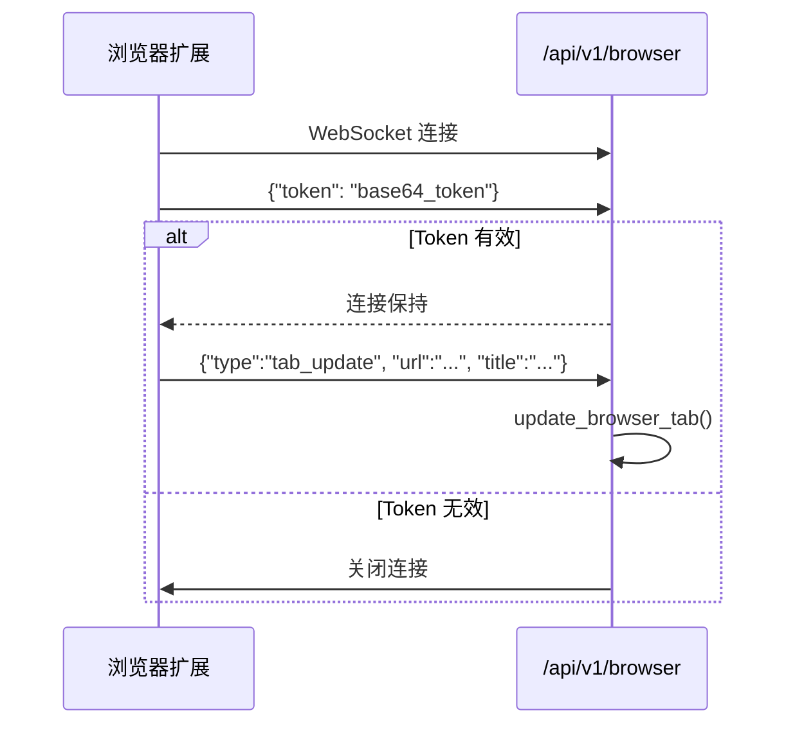

# 浏览器扩展协议

<cite>
**本文档引用的文件**
- [tracker-core/src/api/mod.rs](file://tracker-core/src/api/mod.rs)
- [browser_extension/background.js](file://browser_extension/background.js)
</cite>

## 目录

1. [简介](#简介)
2. [连接流程](#连接流程)
3. [消息格式](#消息格式)
4. [鉴权机制](#鉴权机制)
5. [保活与重连](#保活与重连)

## 简介

浏览器扩展通过专用的 WebSocket 端点 `/api/v1/browser` 与 AppTracker 通信。与通用 `/api/v1/ws` 端点不同，此端点需要 Token 鉴权，且只接受 `tab_update` 类型的消息。

## 连接流程



## 消息格式

### 鉴权消息（第一条消息）

```json
{
  "token": "base64url_encoded_token"
}
```

必须是连接建立后的第一条文本消息。

### Tab 更新消息

```json
{
  "type": "tab_update",
  "browser": "chrome",
  "pid": 12345,
  "windowId": 1,
  "tabId": 123,
  "url": "https://example.com/page",
  "title": "Example Page",
  "favIconUrl": "https://example.com/favicon.ico",
  "active": true
}
```

### 字段说明

| 字段 | 类型 | 必需 | 说明 |
|------|------|------|------|
| `type` | string | 是 | 固定 `"tab_update"` |
| `browser` | string | 否 | 浏览器标识，默认 `"chrome"` |
| `pid` | number | 否 | 浏览器进程 PID |
| `windowId` | number | 否 | 浏览器窗口 ID |
| `tabId` | number | 否 | 标签页 ID |
| `url` | string | 否 | 标签页 URL |
| `title` | string | 否 | 标签页标题 |
| `favIconUrl` | string | 否 | 网站图标 URL |
| `active` | boolean | 否 | 是否活动标签页，默认 `true` |

### 服务器处理

```rust
async fn browser_client(mut socket: WebSocket, state: ApiState) {
    // 1. 读取鉴权消息
    let Some(Ok(Message::Text(raw))) = socket.next().await else { return; };
    let Ok(auth) = serde_json::from_str::<AuthMessage>(&raw) else {
        let _ = socket.close().await;
        return;
    };

    // 2. 验证 Token
    if auth.token.trim() != state.bridge_token.as_str() {
        let _ = socket.close().await;
        return;
    }

    // 3. 消息循环
    while let Some(msg) = socket.next().await {
        if state.tracker.is_paused() { continue; }  // 暂停时忽略
        if let Ok(update) = serde_json::from_str::<TabUpdate>(&raw) {
            if update.message_type == "tab_update" {
                state.tracker.update_browser_tab(update.into_tab()).await;
            }
        }
    }
}
```

## 鉴权机制

### Token 获取

扩展可通过两种方式获取 Token：

1. **自动获取**：调用 `/api/v1/bridge_token` 端点
2. **手动输入**：用户从 AppTracker UI 复制 Token

### 自动获取流程

```javascript
async function fetchTokenFromHost() {
    for (const base of candidateApiBases()) {
        const res = await fetchWithTimeout(`${base}/api/v1/bridge_token`);
        const data = await res.json();
        if (data.token) {
            await chrome.storage.local.set({ token: data.token });
            return data.token;
        }
    }
    return null;
}
```

### Token 存储

Token 存储在 `chrome.storage.local` 中，跨会话持久化：

```javascript
async function loadState() {
    const s = await chrome.storage.local.get(["token", "paused", "apiBase"]);
    token = s.token || null;
    // ...
}
```

## 保活与重连

### Alarm 保活

```javascript
chrome.alarms.create("keepalive", { periodInMinutes: 0.5 });
chrome.alarms.onAlarm.addListener(() => {
    if (!ws || ws.readyState !== WebSocket.OPEN) connect();
});
```

每 30 秒检查一次连接状态。

### 指数退避重连

```javascript
let reconnectDelay = 1000;

function scheduleReconnect() {
    setTimeout(connect, reconnectDelay);
    reconnectDelay = Math.min(reconnectDelay * 2, 30000);
}
```

重连延迟：1s -> 2s -> 4s -> 8s -> 16s -> 30s（上限）。

### 状态指示

扩展图标 badge 显示连接状态：

| 状态 | Badge | 颜色 |
|------|-------|------|
| 已连接 | `*` | 绿色 (#22c55e) |
| 未连接 | `!` | 红色 (#ef4444) |
| 暂停 | 空 | 灰色 (#64748b) |

### 配置变更响应

```javascript
chrome.storage.onChanged.addListener((changes) => {
    if (changes.token) token = changes.token.newValue;
    if (changes.paused) pausedByUser = !!changes.paused.newValue;
    if (changes.apiBase) apiBase = changes.apiBase.newValue;
    // 断开重连
    if (ws) ws.close();
    connect();
});
```

**图表来源**
- [tracker-core/src/api/mod.rs:193-269](file://tracker-core/src/api/mod.rs#L193-L269)
- [browser_extension/background.js:117-168](file://browser_extension/background.js#L117-L168)
