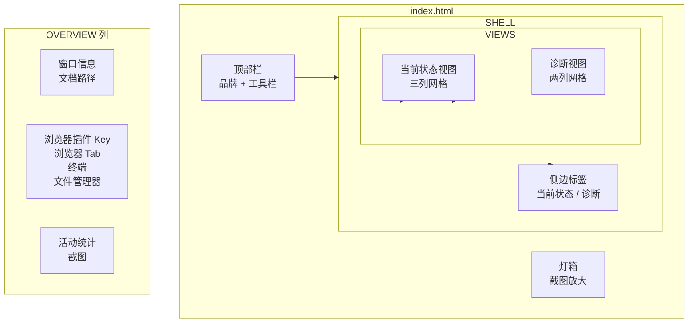

# 前端架构

<cite>
**本文档引用的文件**
- [desktop/ui/index.html](file://desktop/ui/index.html)
- [desktop/ui/main.js](file://desktop/ui/main.js)
- [desktop/ui/styles.css](file://desktop/ui/styles.css)
</cite>

## 目录

1. [简介](#简介)
2. [文档导航](#文档导航)
3. [技术选型](#技术选型)
4. [文件结构](#文件结构)
5. [页面布局](#页面布局)

## 简介

AppTracker 前端采用纯 vanilla HTML/CSS/JS 技术栈，无框架依赖，由 Tauri WebView 直接加载。

## 文档导航

| 文档 | 内容 |
|------|------|
| [UI设计原则](UI设计原则.md) | 设计令牌、组件系统、响应式布局 |
| [数据流与状态管理](数据流与状态管理.md) | WebSocket 连接、事件处理、DOM 更新 |

## 技术选型

| 技术 | 选择 | 理由 |
|------|------|------|
| 框架 | 无（vanilla） | 零构建开销，极小体积 |
| 模块系统 | ES Modules | 浏览器原生支持 |
| CSS 方法论 | CSS 自定义属性 | 设计令牌 + 组件样式 |
| 布局 | CSS Grid + Flexbox | 响应式网格 |
| 实时通信 | WebSocket + Fetch | 事件推送 + REST 调用 |

## 文件结构

```
desktop/ui/
├── index.html      # 单页 HTML（~127 行）
├── main.js         # 应用逻辑（~678 行）
└── styles.css      # 样式（~350 行）
```

总计约 1155 行代码，无构建步骤。

## 页面布局



**图表来源**
- [desktop/ui/index.html:1-127](file://desktop/ui/index.html#L1-L127)
