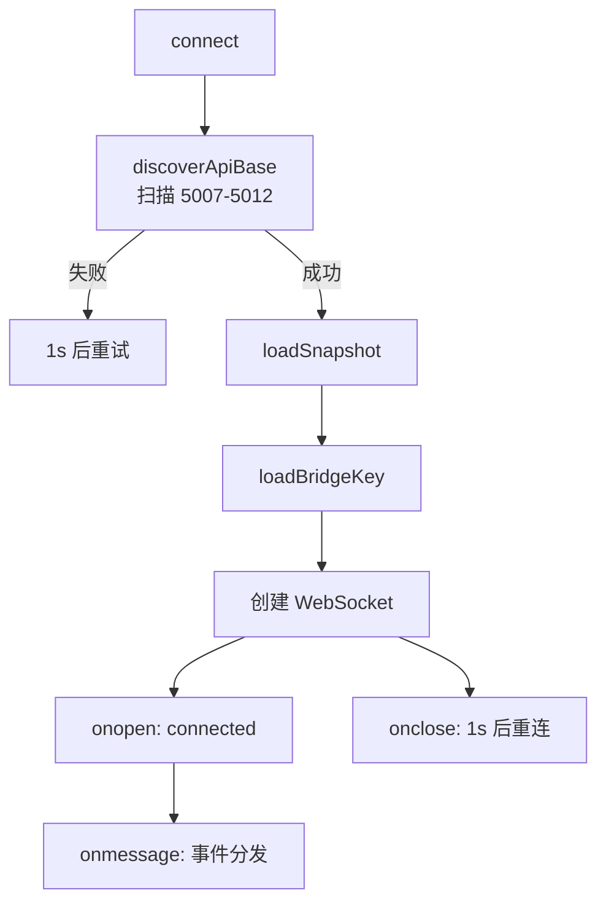

# 数据流与状态管理

<cite>
**本文档引用的文件**
- [desktop/ui/main.js](file://desktop/ui/main.js)
</cite>

## 目录

1. [简介](#简介)
2. [连接管理](#连接管理)
3. [事件处理](#事件处理)
4. [渲染函数](#渲染函数)
5. [状态变量](#状态变量)
6. [性能优化](#性能优化)

## 简介

前端使用简单的全局变量管理状态，通过 WebSocket 接收实时事件并更新 DOM。无框架、无虚拟 DOM、无状态管理库。

## 连接管理

### 连接流程



### API 发现

```javascript
async function discoverApiBase() {
    for (const base of candidateApiBases()) {
        const res = await fetchWithTimeout(`${base}/api/v1/health`);
        if (data.service === "apptracker") {
            setApiBase(base);
            return base;
        }
    }
    return null;
}
```

自动扫描 5007-5012 端口，找到第一个响应 `{"service": "apptracker"}` 的端口。

### 候选地址生成

```javascript
function candidateApiBases(preferred = apiBase) {
    const bases = new Set();
    bases.add(normalized);
    if (["127.0.0.1", "localhost"].includes(url.hostname)) {
        for (let port = 5007; port <= 5012; port++) {
            bases.add(url.toString());
        }
    }
    return Array.from(bases);
}
```

## 事件处理

### WebSocket 消息分发

```javascript
socket.onmessage = (ev) => {
    const msg = JSON.parse(ev.data);
    if (msg.type === "snapshot") renderSnapshot(msg.data);
    if (msg.type === "window_changed") renderWindow(msg.data);
    if (msg.type === "activity_updated") renderActivity(msg.data);
    if (msg.type === "browser_tab_updated") renderBrowser(msg.data);
    if (msg.type === "screenshot_ready") refreshScreenshot();
    if (msg.type === "paused_changed") { paused = !!msg.data; renderPaused(); }
    if (msg.type === "capture_changed") { applyCaptureState(!!msg.data); }
    if (msg.type === "show_process_paths_changed") { applyShowProcessPaths(!!msg.data); renderDocuments(latestDocuments); }
};
```

### 事件 -> 渲染映射

| 事件 | 渲染函数 | 更新的 DOM |
|------|---------|-----------|
| `snapshot` | `renderSnapshot` | 全部 |
| `window_changed` | `renderWindow` | 窗口信息 + 文档 + 终端 + 文件管理器 |
| `activity_updated` | `renderActivity` | 活动统计指标 |
| `browser_tab_updated` | `renderBrowser` | 浏览器标签卡片 |
| `screenshot_ready` | `refreshScreenshot` | 截图 img src |
| `paused_changed` | `renderPaused` | 暂停按钮文字 |
| `capture_changed` | `applyCaptureState` | 截图开关 + 徽章 |
| `show_process_paths_changed` | `applyShowProcessPaths` | 开关 + 文档列表 |

## 渲染函数

### renderWindow

最复杂的渲染函数，更新多个区域：

```javascript
function renderWindow(win) {
    latestWindow = win;
    appBadge.textContent = win.app_name || "无";
    renderGrid("#windowGrid", rows);        // 窗口信息网格
    renderDocuments(win.document_paths || []); // 文档路径列表
    renderTerminal(win.terminal_context);    // 终端上下文
    renderFiles(win.file_manager_state);     // 文件管理器
    renderBrowser(latestBrowserTab);         // 浏览器标签
    renderDiagnostics();                     // 诊断信息
}
```

### renderDocuments

文档路径支持分类过滤：

```javascript
function renderDocuments(docs) {
    const visible = latestDocuments.filter((d) =>
        showProcessPaths || categoryOf(d) !== "process"
    );
    // 渲染卡片列表，包含路径、分类、来源、置信度
}
```

### renderDiagnostics

诊断视图显示所有子系统的状态：

```javascript
function renderDiagnostics() {
    renderGrid("#diagConnection", [...]);  // 连接信息
    // 8 个能力卡片
    const capabilities = [
        capabilityCard("API", ...),
        capabilityCard("浏览器插件", ...),
        capabilityCard("前台窗口", ...),
        capabilityCard("文档路径", ...),
        capabilityCard("文件管理器", ...),
        capabilityCard("终端", ...),
        capabilityCard("活动统计", ...),
        capabilityCard("平台错误", ...),
    ];
}
```

## 状态变量

```javascript
let apiBase = "http://127.0.0.1:5007";  // API 地址
let paused = false;                       // 暂停状态
let captureEnabled = false;               // 截图开关
let showProcessPaths = false;             // 进程路径显示
let ws = null;                            // WebSocket 实例
let reconnectTimer = null;                // 重连定时器
let connectGeneration = 0;                // 连接代次（防止并发重连）
let latestDocuments = [];                 // 最新文档列表
let latestWindow = null;                  // 最新窗口信息
let latestBrowserTab = null;              // 最新浏览器标签
let latestActivity = null;                // 最新活动统计
let apiConnected = false;                 // API 连接状态
```

## 性能优化

### HTML 缓存

```javascript
const htmlCache = new Map();

function setHtml(target, html) {
    const el = typeof target === "string" ? document.querySelector(target) : target;
    if (htmlCache.get(el) === html) return;  // 内容未变化，跳过 DOM 更新
    htmlCache.set(el, html);
    el.innerHTML = html;
}
```

避免不必要的 DOM 操作，当 HTML 内容与上次相同时跳过 `innerHTML` 赋值。

### 截图刷新节流

```javascript
function refreshScreenshot() {
    const now = Date.now();
    if (now - lastScreenshotRefresh < 500) return;  // 500ms 节流
    lastScreenshotRefresh = now;
    screenshotEl.src = `${apiBase}/api/v1/screenshot?t=${Date.now()}`;
}
```

### 定时刷新

```javascript
setInterval(() => {
    renderBrowser(latestBrowserTab);  // 刷新浏览器标签年龄显示
    renderDiagnostics();              // 刷新诊断信息
}, 5000);
```

每 5 秒刷新一次诊断信息和浏览器标签的"X 秒前"显示。

**图表来源**
- [desktop/ui/main.js:1-678](file://desktop/ui/main.js#L1-L678)
