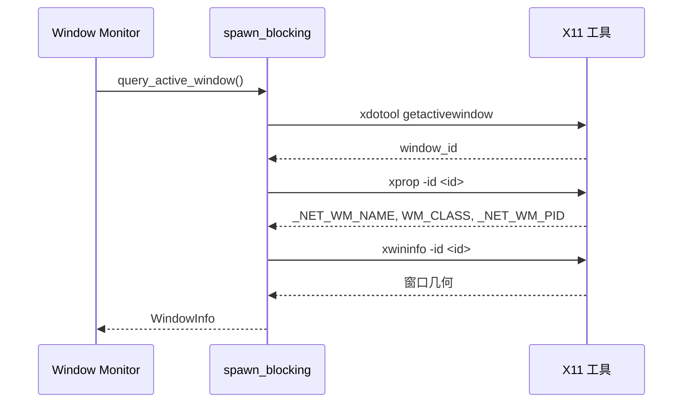
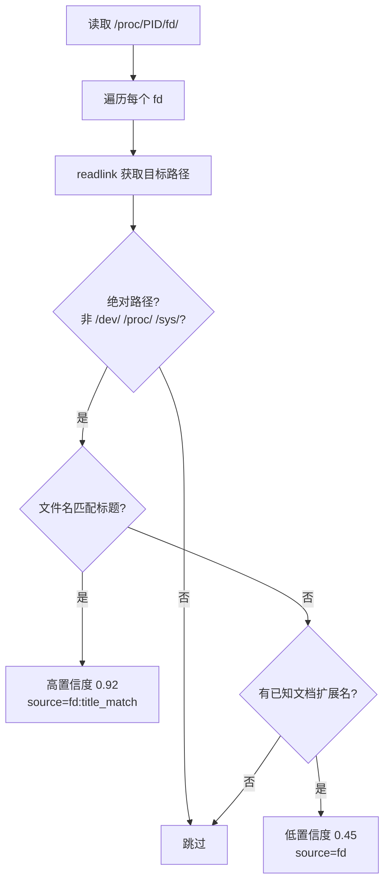
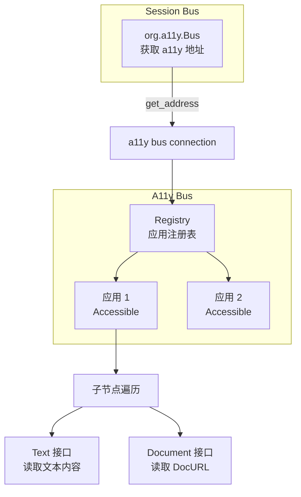

# Linux 平台实现

<cite>
**本文档引用的文件**
- [tracker-core/src/platform/linux.rs](file://tracker-core/src/platform/linux.rs)
- [tracker-core/src/integrations/linux_dbus.rs](file://tracker-core/src/integrations/linux_dbus.rs)
</cite>

## 目录

1. [简介](#简介)
2. [前台窗口查询](#前台窗口查询)
3. [窗口属性解析](#窗口属性解析)
4. [/proc/fd 文件扫描](#procfD-文件扫描)
5. [应用专属检测](#应用专属检测)
6. [AT-SPI 无障碍集成](#at-spi-无障碍集成)
7. [Wayland 限制](#wayland-限制)

## 简介

Linux 平台适配通过 xdotool/xprop 获取前台窗口信息，通过 /proc/PID/fd 扫描打开的文件，通过 AT-SPI（zbus）进行无障碍树遍历。

## 前台窗口查询

### 调用链



### 备用方案

如果 `xdotool` 不可用，回退到 `xprop -root _NET_ACTIVE_WINDOW`：

```rust
fn active_window_id() -> Option<String> {
    cmd_output("xdotool", &["getactivewindow"]).map(|s| s.trim().to_string())
}

fn active_window_id_from_xprop() -> Option<String> {
    let text = cmd_output("xprop", &["-root", "_NET_ACTIVE_WINDOW"])?;
    let id = text.split_whitespace().last()?.trim_end_matches(',');
    if id == "0x0" { None } else { Some(id.to_string()) }
}
```

### 命令执行器

所有外部命令有 700ms 超时保护：

```rust
fn cmd_output(cmd: &str, args: &[&str]) -> Option<String> {
    let timeout = Duration::from_millis(700);
    // spawn + 轮询等待 + 超时 kill
}
```

## 窗口属性解析

### xprop 输出解析

```rust
fn parse_xprop_string(text: &str, key: &str) -> Option<String> {
    // _NET_WM_NAME(UTF8_STRING) = "window title"
    // WM_CLASS(STRING) = "instance", "class"
}

fn parse_xprop_u32(text: &str, key: &str) -> Option<u32> {
    // _NET_WM_PID(CARDINAL) = 1234
}
```

### WM_CLASS 特殊处理

WM_CLASS 包含两个字符串（实例名和类名），取后者作为窗口类：

```rust
if key == "WM_CLASS" {
    let values = line.split('"').filter(|s| !s.is_empty() && *s != ", ").collect::<Vec<_>>();
    return values.last().map(|s| s.to_string());
}
```

### xwininfo 几何解析

```rust
fn parse_xwininfo_geometry(text: &str) -> Option<WindowGeometry> {
    // Absolute upper-left X: 100
    // Absolute upper-left Y: 200
    // Width: 800
    // Height: 600
}
```

## /proc/fd 文件扫描

### 原理

Linux 的 `/proc/PID/fd/` 目录包含进程打开的所有文件描述符的符号链接：

```bash
ls -la /proc/1234/fd/
# lrwx------ 1 user user 64 Jun 28 10:00 3 -> /home/user/docs/report.md
# lrwx------ 1 user user 64 Jun 28 10:00 4 -> /tmp/cache.db
```

### 扫描逻辑



### 过滤规则

| 条件 | 处理 |
|------|------|
| 非绝对路径（socket、pipe） | 跳过 |
| `/dev/`、`/proc/`、`/sys/` 开头 | 跳过 |
| 包含 `(deleted)` | 跳过 |
| 文件名匹配窗口标题 | 高置信度 0.92 |
| 有已知文档扩展名 | 低置信度 0.45 |
| 其他 | 跳过 |

### 容量限制

```rust
if count > 4000 {
    tracing::warn!(pid, "proc_fd_documents: scan cap reached (4000)");
    break;
}
```

## 应用专属检测

### LibreOffice

LibreOffice 将打开的文件作为命令行参数传递：

```rust
fn per_executable_documents(pid: u32, exe: &str) -> Vec<DocumentSource> {
    let is_libreoffice = exe_lower.contains("soffice")
        || exe_lower.contains("libreoffice")
        || exe_lower.contains("oosplash");
    if !is_libreoffice { return Vec::new(); }

    // 读取 /proc/PID/cmdline，按 NUL 分割
    let bytes = std::fs::read(format!("/proc/{pid}/cmdline"))?;
    for arg in bytes.split(|b| *b == 0) {
        if !arg.starts_with('-') {
            // 非 flag 参数可能是文件路径
            document_from_existing_path(&s, "libreoffice:argv", 0.85, User)
        }
    }
}
```

## AT-SPI 无障碍集成

### 架构



### 实现细节

1. 通过 `org.a11y.Bus` 获取 a11y bus 地址
2. 连接 a11y bus，遍历 Registry 的子节点找到目标 PID 的应用
3. 遍历应用的子节点，读取 Text 接口中的路径文本
4. 最多遍历 400 个节点，每个调用 200ms 超时

### 文件管理器状态

AT-SPI 可以获取文件管理器当前显示的目录和选中项：

```rust
pub async fn file_manager_state(info: &WindowInfo) -> Option<FileManagerState> {
    let conn = a11y_connection().await?;
    let (service, root) = find_application_by_pid(&conn, pid).await?;
    let texts = collect_path_texts(&conn, service, root).await;
    // 从文本中识别目录和文件
}
```

### Document 接口

LibreOffice 等应用通过 AT-SPI 的 Document 接口暴露 `DocURL`：

```rust
pub async fn document_url_for(info: &WindowInfo) -> Vec<DocumentSource> {
    let proxy = DocumentProxy::builder(&conn)...;
    let url = proxy.get_attribute_value("DocURL").await?;
    // 解析为 DocumentSource
}
```

## Wayland 限制

### 检测

```rust
if std::env::var("XDG_SESSION_TYPE").unwrap_or_default() == "wayland" {
    info.errors.push("Running under Wayland; generic active-window capture is limited".to_string());
}
```

### 限制内容

| 功能 | X11 | Wayland |
|------|-----|---------|
| 前台窗口 ID | 完整支持 | 受限（xdotool 部分工作） |
| 窗口标题 | 完整支持 | 受限 |
| 窗口几何 | 完整支持 | 不可靠 |
| /proc/fd | 完整支持 | 完整支持 |
| AT-SPI | 完整支持 | 完整支持 |

Wayland 的安全模型不允许客户端查询其他窗口的信息，但 /proc/fd 和 AT-SPI 仍可用。

**图表来源**
- [tracker-core/src/platform/linux.rs:1-275](file://tracker-core/src/platform/linux.rs#L1-L275)
- [tracker-core/src/integrations/linux_dbus.rs:1-283](file://tracker-core/src/integrations/linux_dbus.rs#L1-L283)
