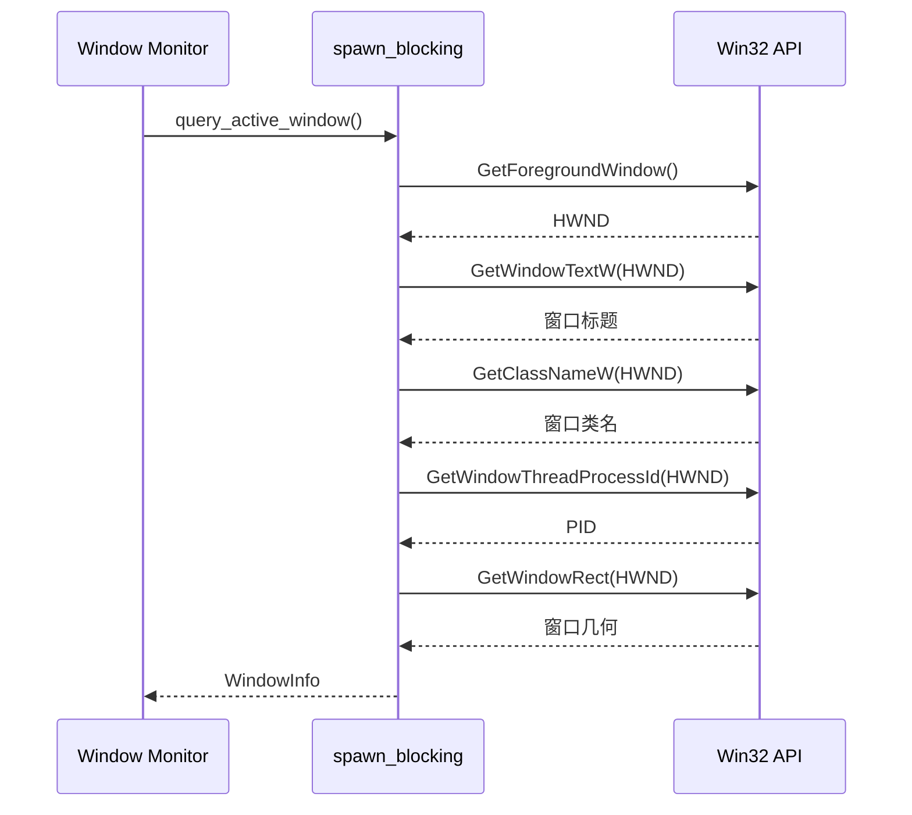

# Windows 平台实现

<cite>
**本文档引用的文件**
- [tracker-core/src/platform/windows.rs](file://tracker-core/src/platform/windows.rs)
</cite>

## 目录

1. [简介](#简介)
2. [前台窗口查询](#前台窗口查询)
3. [Office 文档检测](#office-文档检测)
4. [UIA 无障碍树遍历](#uia-无障碍树遍历)
5. [PowerShell 脚本执行](#powershell-脚本执行)
6. [输出解码](#输出解码)

## 简介

Windows 平台适配通过 Win32 API 获取前台窗口基础信息，通过 COM 自动化和 UIA（UI Automation）无障碍树遍历获取文档路径。所有 PowerShell 调用都有超时保护。

## 前台窗口查询

### 调用链



### 采集字段

| 字段 | Win32 API | 说明 |
|------|----------|------|
| `window_id` | `HWND` 格式化为字符串 | 窗口句柄 |
| `window_title` | `GetWindowTextW` | 窗口标题（UTF-16 解码） |
| `window_class` | `GetClassNameW` | 窗口类名（如 `CabinetWClass`） |
| `geometry` | `GetWindowRect` | 窗口位置和尺寸 |
| `process` | sysinfo `process_info` | PID、可执行文件、cmdline、cwd |

### 安全调用

所有 Win32 API 调用通过 `unsafe` 块执行，但仅限于 FFI 边界：

```rust
let hwnd = unsafe { GetForegroundWindow() };
if is_null_hwnd(hwnd) {
    info.errors.push("No foreground window".to_string());
    return Ok(info);
}
```

## Office 文档检测

### COM 自动化

通过 `Marshal.GetActiveObject` 获取 Office 应用的 COM 对象：

```powershell
# Word
$app = [Runtime.InteropServices.Marshal]::GetActiveObject('Word.Application')
$active = $app.ActiveDocument.FullName

# Excel
$app = [Runtime.InteropServices.Marshal]::GetActiveObject('Excel.Application')
$active = $app.ActiveWorkbook.FullName

# PowerPoint
$app = [Runtime.InteropServices.Marshal]::GetActiveObject('PowerPoint.Application')
$active = $app.ActivePresentation.FullName
```

### 支持的 ProgId

| 应用 | ProgId | 文档属性 |
|------|--------|---------|
| Microsoft Word | `Word.Application` | `ActiveDocument.FullName` |
| WPS Writer | `KWPS.Application` / `WPS.Application` | `ActiveDocument.FullName` |
| Microsoft Excel | `Excel.Application` | `ActiveWorkbook.FullName` |
| WPS 表格 | `KET.Application` / `ET.Application` | `ActiveWorkbook.FullName` |
| PowerPoint | `PowerPoint.Application` | `ActivePresentation.FullName` |
| WPS 演示 | `KWPP.Application` / `WPP.Application` | `ActivePresentation.FullName` |

### 输出格式

```
office:word:active|C:\Users\user\Documents\report.docx
office:excel|C:\Users\user\Documents\data.xlsx
```

### 触发条件

```rust
fn is_office_like(info: &WindowInfo) -> bool {
    // 检查 app_name、executable、process name 是否包含
    // "winword"、"excel"、"powerpnt"、"wps"、"kwps" 等关键词
}
```

## UIA 无障碍树遍历

### 适用场景

对于非 Office 但有文档概念的应用（Typora、Notepad++、VS Code、Obsidian、Acrobat 等），通过 UIA 遍历其控件树，提取 Name 和 Value 属性中的路径。

### 遍历算法

```mermaid
graph TD
    ROOT[AutomationElement.FromHandle(HWND)] --> QUEUE[初始化队列]
    QUEUE --> DEQUEUE[出队一个元素]
    DEQUEUE --> NAME[读取 Name 属性]
    DEQUEUE --> VALUE[尝试 ValuePattern]
    DEQUEUE --> CHILDREN[FindAll Children]
    CHILDREN --> ENQUEUE[子元素入队]
    ENQUEUE --> CHECK{visited < 260?}
    CHECK -->|是| DEQUEUE
    CHECK -->|否| END[结束遍历]
```

### 输出格式

```
uia:name|C:\Users\user\Documents\report.md
uia:value|C:\Users\user\Documents\data.xlsx
```

### 触发条件

```rust
fn should_scan_uia(info: &WindowInfo) -> bool {
    is_office_like(info)
        || likely_document_name_from_title(&info.window_title).is_some()
        || haystack.contains("typora")
        || haystack.contains("notepad")
        || haystack.contains("code.exe")
        // ... 更多应用关键词
}
```

## PowerShell 脚本执行

### 通用执行器

```rust
fn run_powershell_utf8(script: &str, timeout: Duration) -> Option<String> {
    let mut child = Command::new("powershell.exe")
        .args(["-NoLogo", "-NoProfile", "-ExecutionPolicy", "Bypass", "-Command", script])
        .stdout(Stdio::piped())
        .stderr(Stdio::null())
        .spawn().ok()?;

    // 轮询等待，超时则 kill
    loop {
        if child.try_wait().ok().flatten().is_some() {
            return Some(decode_process_output(&output.stdout));
        }
        if started.elapsed() >= timeout {
            let _ = child.kill();
            return None;
        }
        std::thread::sleep(Duration::from_millis(25));
    }
}
```

### 超时配置

| 脚本 | 超时 | 说明 |
|------|------|------|
| Office COM | 900ms | COM 对象可能阻塞 |
| UIA 遍历 | 1200ms | 遍历 260 个节点 |
| Explorer COM | 1500ms | 文件管理器可能卡顿 |

### UTF-8 编码

所有 PowerShell 脚本开头统一设置 UTF-8 输出：

```powershell
$utf8 = [System.Text.UTF8Encoding]::new($false)
[Console]::OutputEncoding = $utf8
$OutputEncoding = $utf8
```

## 输出解码

PowerShell 可能输出 UTF-16 LE（带 BOM）或 UTF-8，解码器自动检测：

```rust
fn decode_process_output(bytes: &[u8]) -> String {
    if bytes.starts_with(&[0xff, 0xfe]) {
        return decode_utf16le(&bytes[2..]);  // UTF-16 LE BOM
    }
    if bytes.starts_with(&[0xfe, 0xff]) {
        return decode_utf16be(&bytes[2..]);  // UTF-16 BE BOM
    }
    // 启发式检测：奇数字节位置大量 NUL -> UTF-16 LE
    let nul_odd = bytes.iter().skip(1).step_by(2).filter(|b| **b == 0).count();
    if nul_odd > bytes.len() / 8 {
        return decode_utf16le(bytes);
    }
    String::from_utf8_lossy(bytes).to_string()
}
```

**图表来源**
- [tracker-core/src/platform/windows.rs:1-378](file://tracker-core/src/platform/windows.rs#L1-L378)
