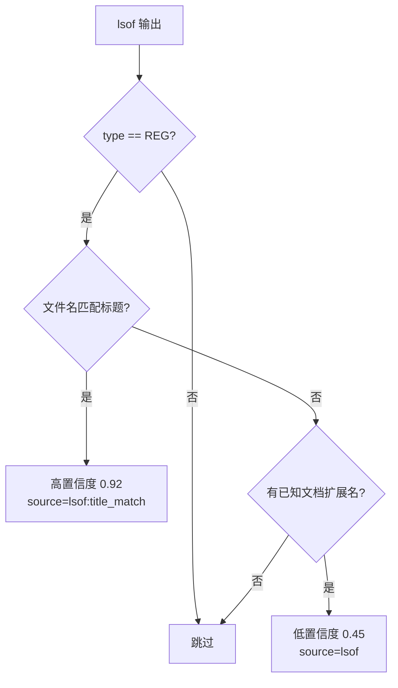

# macOS 平台实现

<cite>
**本文档引用的文件**
- [tracker-core/src/platform/macos.rs](file://tracker-core/src/platform/macos.rs)
</cite>

## 目录

1. [简介](#简介)
2. [前台窗口查询](#前台窗口查询)
3. [Accessibility 属性读取](#accessibility-属性读取)
4. [应用专属 AppleScript](#应用专属-applescript)
5. [lsof 文件扫描](#lsof-文件扫描)
6. [osascript 执行器](#osascript-执行器)

## 简介

macOS 平台适配通过 AppleScript 获取前台窗口基础信息，通过 Accessibility（AX）属性和应用专属 AppleScript dictionary 获取文档路径，通过 lsof 扫描进程打开的文件。

## 前台窗口查询

### AppleScript 脚本

```applescript
tell application "System Events"
    set frontApp to first application process whose frontmost is true
    set appName to name of frontApp
    set pidVal to unix id of frontApp
    set bundleVal to bundle identifier of frontApp
    set titleVal to name of front window of frontApp
    set posVal to position of front window of frontApp
    set sizeVal to size of front window of frontApp
    return appName & tab & pidVal & tab & bundleVal & tab & titleVal & ...
end tell
```

### 采集字段

| 字段 | AppleScript 属性 | 说明 |
|------|-----------------|------|
| `app_name` | `name of frontApp` | 应用名称 |
| `app_bundle_id` | `bundle identifier` | Bundle ID（如 `com.apple.Safari`） |
| `window_title` | `name of front window` | 窗口标题 |
| `geometry` | `position` + `size` | 窗口位置和尺寸 |
| `process` | sysinfo `process_info` | PID 等进程信息 |

### 超时保护

osascript 调用有 900ms 超时：

```rust
let Some(text) = run_osascript(script, Duration::from_millis(900)) else {
    info.errors.push("osascript unavailable, failed, or timed out".to_string());
    return Ok(info);
};
```

## Accessibility 属性读取

### AXDocument / AXURL

原生 Cocoa 应用通常在窗口上暴露 `AXDocument` 和 `AXURL` 属性：

```applescript
tell application "System Events"
    set proc to first process whose unix id is <PID>
    set win to front window of proc
    set v to value of attribute "AXDocument" of win  -- 文件路径
    set v to value of attribute "AXURL" of win       -- file:// URL
end tell
```

### 置信度

| 属性 | 置信度 | 说明 |
|------|--------|------|
| `ax:doc` | 0.95 | AXDocument 属性 |
| `ax:url` | 0.90 | AXURL 属性 |

### 适用范围

AX 属性对大多数原生 Cocoa 应用有效，但 Electron/Qt 应用通常不暴露这些属性。

## 应用专属 AppleScript

对于有 AppleScript dictionary 的应用，直接查询其文档模型：

### Microsoft Office

| Bundle ID | 应用 | 查询对象 |
|-----------|------|---------|
| `com.microsoft.Word` | Word | `active document` -> `full name` |
| `com.microsoft.Excel` | Excel | `active workbook` -> `full name` |
| `com.microsoft.Powerpoint` | PowerPoint | `active presentation` -> `full name` |

### 浏览器

| Bundle ID | 应用 | 查询对象 |
|-----------|------|---------|
| `com.google.Chrome` | Chrome | `URL of active tab of front window` |
| `com.brave.Browser` | Brave | 同上 |
| `com.microsoft.edgemac` | Edge | 同上 |
| `com.apple.Safari` | Safari | `URL of front document` |
| `company.thebrowser.Browser` | Arc | 同 Chrome |

### 编辑器

| Bundle ID | 应用 | 查询对象 |
|-----------|------|---------|
| `com.sublimetext.4` | Sublime Text | `file name of active document` |
| `abnerworks.Typora` | Typora | 窗口名称（作为 lsof 的标题提示） |

### 置信度

应用专属查询的置信度为 0.99（活动文档）或 0.90（浏览器 URL）。

## lsof 文件扫描

### 原理

`lsof -p PID -F nt` 列出进程打开的所有常规文件：

```bash
lsof -p 1234 -F nt
# 输出格式：
# f<fd_number>
# tREG
# n/path/to/file
```

### 过滤策略

lsof 返回大量文件（日志、缓存、数据库等），需要严格过滤：



### 标题匹配

将窗口标题中的文件名与 lsof 返回的文件 basename 比较：

```rust
let basenames: HashSet<String> = title_hints.iter()
    .filter_map(|t| likely_document_name_from_title(t))
    .collect();
// ...
let matches_title = basenames.contains(basename);
```

### 容量限制

为避免浏览器/IDE 等大型进程的 fd 列表过长，限制扫描 4000 条：

```rust
if count >= 4000 { break; }
```

## osascript 执行器

### 通用执行器

```rust
fn run_osascript(script: &str, timeout: Duration) -> Option<String> {
    let mut child = Command::new("osascript")
        .arg("-e").arg(script)
        .stdout(Stdio::piped())
        .stderr(Stdio::null())
        .spawn().ok()?;

    loop {
        if child.try_wait().ok().flatten().is_some() {
            return Some(String::from_utf8_lossy(&output.stdout).to_string());
        }
        if started.elapsed() >= timeout {
            let _ = child.kill();
            return None;
        }
        std::thread::sleep(Duration::from_millis(25));
    }
}
```

### 超时配置

| 脚本类型 | 超时 | 说明 |
|---------|------|------|
| 窗口查询 | 900ms | System Events 可能被权限弹窗阻塞 |
| AX 属性 | 900ms | 无障碍属性读取 |
| Office AS | 900ms | Office AppleScript |
| 浏览器 AS | 900ms | 浏览器 AppleScript |
| Typora 窗口名 | 600ms | 轻量查询 |
| Finder | 1200ms | 文件管理器可能卡顿 |

### 权限问题

macOS 的 Accessibility 和 Automation 权限可能导致 osascript 被系统弹窗阻塞。超时机制确保不会无限等待。超时时会记录警告日志提示用户检查权限。

**图表来源**
- [tracker-core/src/platform/macos.rs:1-494](file://tracker-core/src/platform/macos.rs#L1-L494)
