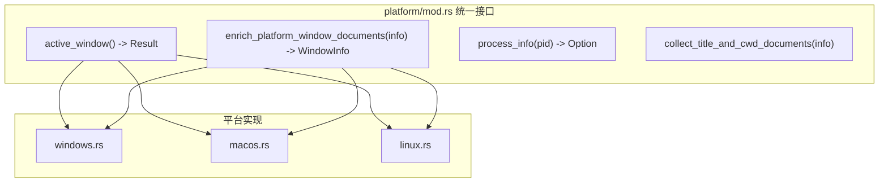
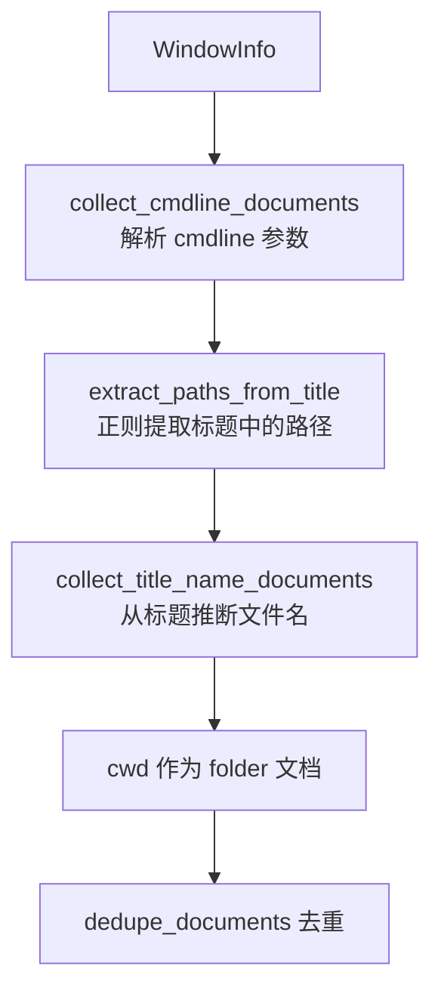

# 平台适配层

<cite>
**本文档引用的文件**
- [tracker-core/src/platform/mod.rs](file://tracker-core/src/platform/mod.rs)
- [tracker-core/src/platform/windows.rs](file://tracker-core/src/platform/windows.rs)
- [tracker-core/src/platform/macos.rs](file://tracker-core/src/platform/macos.rs)
- [tracker-core/src/platform/linux.rs](file://tracker-core/src/platform/linux.rs)
</cite>

## 目录

1. [简介](#简介)
2. [文档导航](#文档导航)
3. [平台抽象接口](#平台抽象接口)
4. [三平台对比](#三平台对比)
5. [公共逻辑](#公共逻辑)

## 简介

平台适配层封装了三平台（Windows/macOS/Linux）的前台窗口查询和文档路径采集逻辑，通过条件编译和统一接口对上层透明。

## 文档导航

| 文档 | 内容 |
|------|------|
| [Windows平台实现](Windows平台实现.md) | Win32 API + COM + UIA + PowerShell |
| [macOS平台实现](macOS平台实现.md) | AppleScript + Accessibility + lsof |
| [Linux平台实现](Linux平台实现.md) | xdotool + /proc/fd + AT-SPI |

## 平台抽象接口



### 接口签名

| 函数 | 说明 |
|------|------|
| `active_window()` | 查询当前前台窗口的基础信息（进程、标题、几何） |
| `enrich_platform_window_documents(info)` | 平台特定的文档路径富化 |
| `process_info(pid)` | 通过 sysinfo 获取进程详细信息 |
| `collect_title_and_cwd_documents(info)` | 从标题和 cmdline 提取文档路径（跨平台公共） |

### 条件编译

```rust
#[cfg(target_os = "windows")]
pub use self::windows::active_window;
#[cfg(target_os = "macos")]
pub use self::macos::active_window;
#[cfg(target_os = "linux")]
pub use self::linux::active_window;
```

不支持的平台返回空 WindowInfo + 错误信息。

## 三平台对比

### 窗口查询

| 能力 | Windows | macOS | Linux |
|------|---------|-------|-------|
| 前台窗口 | `GetForegroundWindow` | AppleScript `System Events` | `xdotool getactivewindow` |
| 窗口标题 | `GetWindowTextW` | AppleScript `name of winRef` | `xprop _NET_WM_NAME` |
| 窗口类名 | `GetClassNameW` | bundle identifier | `xprop WM_CLASS` |
| 窗口几何 | `GetWindowRect` | AppleScript `position/size` | `xwininfo` |
| 进程 PID | `GetWindowThreadProcessId` | AppleScript `unix id` | `xprop _NET_WM_PID` |

### 文档富化

| 能力 | Windows | macOS | Linux |
|------|---------|-------|-------|
| Office 文档 | COM `GetActiveObject` | AppleScript dictionary | /proc/PID/cmdline |
| 通用文档 | UIA 遍历 | AX `AXDocument`/`AXURL` | AT-SPI Document |
| 打开文件 | - | `lsof -p PID` | /proc/PID/fd |
| 浏览器 URL | - | AppleScript dictionary | - |

### 阻塞操作处理

所有平台 API 调用都在 `spawn_blocking` 中执行：

| 平台 | 阻塞操作 | 超时 |
|------|---------|------|
| Windows | PowerShell COM/UIA 脚本 | 900ms~1500ms |
| macOS | osascript 进程 | 600ms~1200ms |
| Linux | xdotool/xprop/xwininfo 进程 | 700ms |

## 公共逻辑

### collect_title_and_cwd_documents

`platform/mod.rs` 中的公共函数，从标题、cmdline 和 cwd 提取文档路径：



### candidate_search_dirs

标题文件名搜索的候选目录：

1. 进程 cwd
2. 用户主目录 `~/`
3. `~/Desktop`
4. `~/Documents`
5. `~/Downloads`
6. `~/OneDrive/Desktop`
7. `~/OneDrive/Documents`

**图表来源**
- [tracker-core/src/platform/mod.rs:1-170](file://tracker-core/src/platform/mod.rs#L1-L170)
