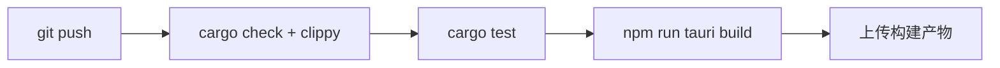

# 构建与部署

<cite>
**本文档引用的文件**
- [Cargo.toml](file://Cargo.toml)
- [tracker-core/Cargo.toml](file://tracker-core/Cargo.toml)
- [desktop/src-tauri/Cargo.toml](file://desktop/src-tauri/Cargo.toml)
- [desktop/src-tauri/tauri.conf.json](file://desktop/src-tauri/tauri.conf.json)
</cite>

## 目录

1. [简介](#简介)
2. [Workspace 结构](#workspace-结构)
3. [开发构建](#开发构建)
4. [Release 构建](#release-构建)
5. [Feature Flags](#feature-flags)
6. [Tauri 配置](#tauri-配置)
7. [CI/CD](#cicd)

## 简介

本文档描述 AppTracker 的构建系统、Feature Flags 配置和打包部署流程。

## Workspace 结构

```toml
[workspace]
members = [
    "tracker-core",
    "desktop/src-tauri",
]
resolver = "2"

[workspace.package]
edition = "2021"
license = "MIT"
version = "0.1.0"
```

两个 crate 共享版本号和 edition 配置。

## 开发构建

### 完整开发模式

```bash
cd desktop
npm install
npm run tauri dev
```

启动 Vite 开发服务器 + Tauri WebView 窗口，支持前端热重载。

### 仅核心库

```bash
cd tracker-core
cargo build           # 默认 features（activity + capture）
cargo build --no-default-features  # 禁用所有可选功能
cargo test            # 运行测试
cargo clippy          # 代码检查
```

### 仅 Tauri 后端

```bash
cd desktop/src-tauri
cargo build
```

## Release 构建

```bash
cd desktop
npm run tauri build
```

### 产出物

| 平台 | 路径 |
|------|------|
| Windows | `desktop/src-tauri/target/release/AppTracker.exe` |
| macOS | `desktop/src-tauri/target/release/bundle/dmg/` |
| Linux | `desktop/src-tauri/target/release/bundle/deb/` |

### Windows 子系统

Release 构建使用 Windows GUI subsystem，避免弹出控制台窗口：

```rust
#![cfg_attr(not(debug_assertions), windows_subsystem = "windows")]
```

## Feature Flags

### tracker-core features

```toml
[features]
default = ["activity", "capture"]
activity = ["dep:rdev"]
capture = ["dep:image", "dep:screenshots"]
```

### 禁用示例

```bash
# 无键鼠监听、无截图
cargo build --no-default-features

# 仅键鼠监听
cargo build --no-default-features --features activity

# 仅截图
cargo build --no-default-features --features capture
```

### 依赖大小影响

| Feature | 额外依赖 | 大致增量 |
|---------|---------|---------|
| `activity` | rdev | ~500KB |
| `capture` | screenshots + image | ~2MB |

## Tauri 配置

### tauri.conf.json 关键配置

```json
{
  "build": {
    "devUrl": "http://localhost:5173",
    "frontendDist": "../ui"
  },
  "app": {
    "windows": [{
      "title": "AppTracker",
      "width": 1200,
      "height": 800
    }]
  }
}
```

- **devUrl**：开发模式下 Vite 服务器地址
- **frontendDist**：release 构建时的前端静态文件目录

### 权限配置

Tauri v2 需要在 `capabilities/` 中声明权限。AppTracker 的前端仅通过 HTTP/WebSocket 与后端通信，不使用 Tauri IPC，因此权限配置最小化。

## CI/CD

### 推荐流程



### 检查命令

```bash
# 类型检查
cargo check --workspace

# Lint
cargo clippy --workspace -- -D warnings

# 测试
cargo test --workspace

# 前端无构建步骤，无需检查
```

### 跨平台构建

Tauri 支持交叉编译，但推荐在目标平台上原生构建：

| 平台 | 构建环境 |
|------|---------|
| Windows | Windows + MSVC |
| macOS | macOS + Xcode |
| Linux | Ubuntu + GCC |

**图表来源**
- [Cargo.toml:1-14](file://Cargo.toml#L1-L14)
- [tracker-core/Cargo.toml:26-29](file://tracker-core/Cargo.toml#L26-L29)
