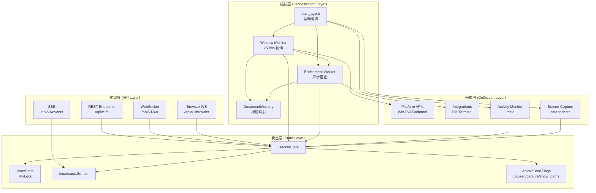
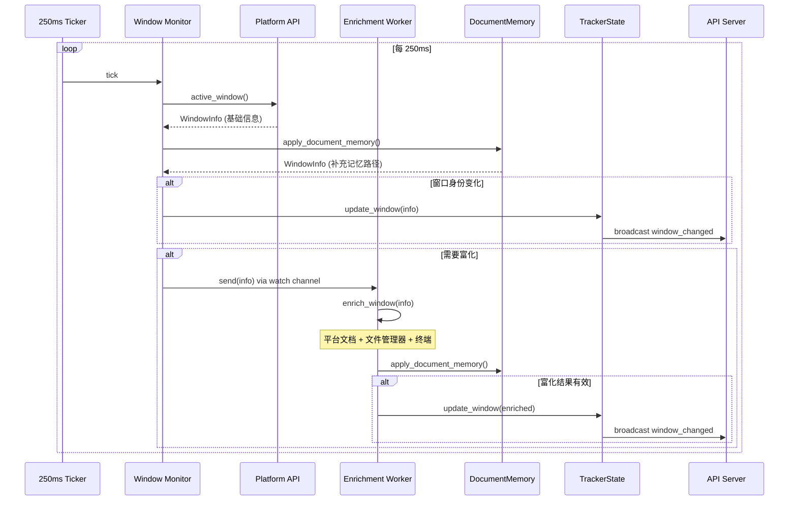
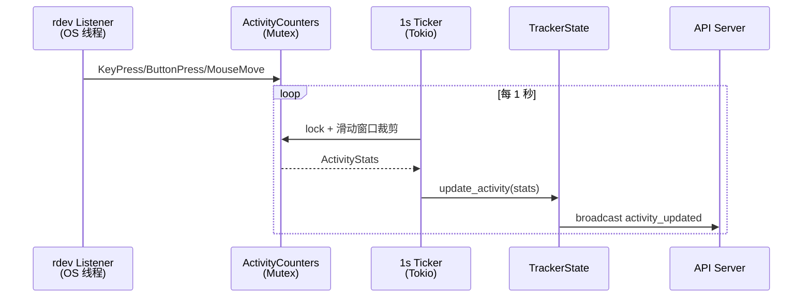

# 整体架构概览

<cite>
**本文档引用的文件**
- [tracker-core/src/agent.rs](file://tracker-core/src/agent.rs)
- [tracker-core/src/api/mod.rs](file://tracker-core/src/api/mod.rs)
- [tracker-core/src/state.rs](file://tracker-core/src/state.rs)
</cite>

## 目录

1. [简介](#简介)
2. [系统分层](#系统分层)
3. [数据流](#数据流)
4. [组件职责](#组件职责)
5. [通信机制](#通信机制)

## 简介

AppTracker 的架构分为四层：采集层、编排层、状态层和接口层。本文档描述各层的职责、数据流向和组件间通信方式。

## 系统分层



## 数据流

### 窗口监控主循环



### 活动统计流



## 组件职责

| 组件 | 职责 | 线程模型 |
|------|------|---------|
| `start_agent` | 初始化所有子系统，返回 AgentHandle | Tokio async |
| `Window Monitor` | 轮询前台窗口，触发富化 | Tokio task |
| `Enrichment Worker` | 异步执行文档富化管道 | Tokio task |
| `DocumentMemory` | 标题-路径映射缓存 | Arc Mutex |
| `Activity Monitor` | 键鼠事件监听 + 统计 | OS 线程 + Tokio task |
| `Screen Capture` | 定时截图 | Tokio task (spawn_blocking) |
| `TrackerState` | 共享状态存储 + 事件广播 | Arc RwLock + broadcast |
| `API Server` | HTTP/WS/SSE 服务 | Tokio task (Axum) |
| `Browser Bridge` | 浏览器扩展 WebSocket 连接 | Tokio task (Axum WS) |

## 通信机制

### 状态变更通知

TrackerState 使用 `broadcast::channel(256)` 广播所有状态变更事件：

```rust
pub async fn update_window(&self, info: WindowInfo) {
    self.inner.write().await.window = Some(info.clone());
    let _ = self.tx.send(TrackerEvent::new("window_changed", &info));
}
```

所有 API 客户端（WS、SSE）通过 `state.subscribe()` 获取 Receiver。

### 富化管道通信

Window Monitor 和 Enrichment Worker 之间通过 `watch::channel` 通信：

```rust
let (enrich_tx, enrich_rx) = tokio::sync::watch::channel(None::<WindowInfo>);
```

watch channel 的特性：新值覆盖旧值，适合"只需要最新状态"的场景。

### 原子标志位

暂停、截图开关等布尔状态使用 `AtomicBool`，避免获取写锁：

```rust
paused: Arc<AtomicBool>,
capture_enabled: Arc<AtomicBool>,
show_process_paths: Arc<AtomicBool>,
```

**图表来源**
- [tracker-core/src/agent.rs:45-71](file://tracker-core/src/agent.rs#L45-L71)
- [tracker-core/src/api/mod.rs:71-88](file://tracker-core/src/api/mod.rs#L71-L88)
- [tracker-core/src/state.rs:17-24](file://tracker-core/src/state.rs#L17-L24)
