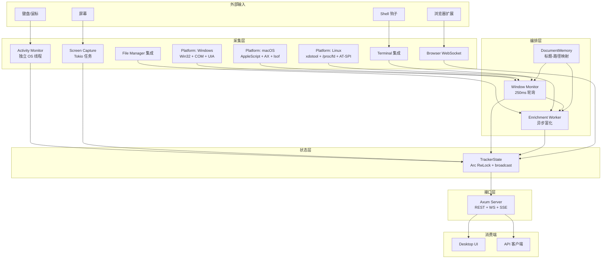

# 架构设计

<cite>
**本文档引用的文件**
- [tracker-core/src/agent.rs](file://tracker-core/src/agent.rs)
- [tracker-core/src/state.rs](file://tracker-core/src/state.rs)
- [tracker-core/src/lib.rs](file://tracker-core/src/lib.rs)
</cite>

## 目录

1. [简介](#简介)
2. [文档导航](#文档导航)
3. [架构全景](#架构全景)
4. [核心设计原则](#核心设计原则)

## 简介

本章深入分析 AppTracker 的架构设计，包括整体架构概览、模块依赖关系、设计模式和进程模型。

## 文档导航

| 文档 | 内容 |
|------|------|
| [整体架构概览](整体架构概览.md) | 系统组件关系、数据流、分层架构 |
| [模块关系与依赖](模块关系与依赖.md) | crate 内部模块依赖图、接口边界 |
| [设计模式与架构原则](设计模式与架构原则.md) | 采用的设计模式和架构原则 |
| [进程模型与生命周期](进程模型与生命周期.md) | 任务启动、supervised 重启、关闭流程 |

## 架构全景

## 核心设计原则

1. **单一数据源**：所有状态集中存储在 TrackerState 中，通过 broadcast channel 推送变更
2. **异步优先**：IO 密集操作（平台 API 调用、文件扫描）在 `spawn_blocking` 中执行，不阻塞 Tokio 运行时
3. **supervised 重启**：关键任务通过 `supervised()` 包装，panic 后自动重启
4. **Feature Gate**：可选功能（activity、capture）通过 Cargo feature flags 控制编译
5. **跨平台抽象**：`platform/mod.rs` 通过条件编译和 trait 统一三平台接口

**图表来源**
- [tracker-core/src/agent.rs:45-71](file://tracker-core/src/agent.rs#L45-L71)
- [tracker-core/src/state.rs:1-137](file://tracker-core/src/state.rs#L1-L137)
