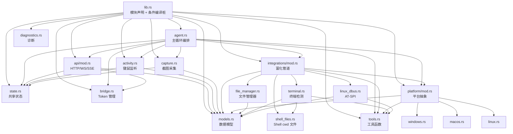
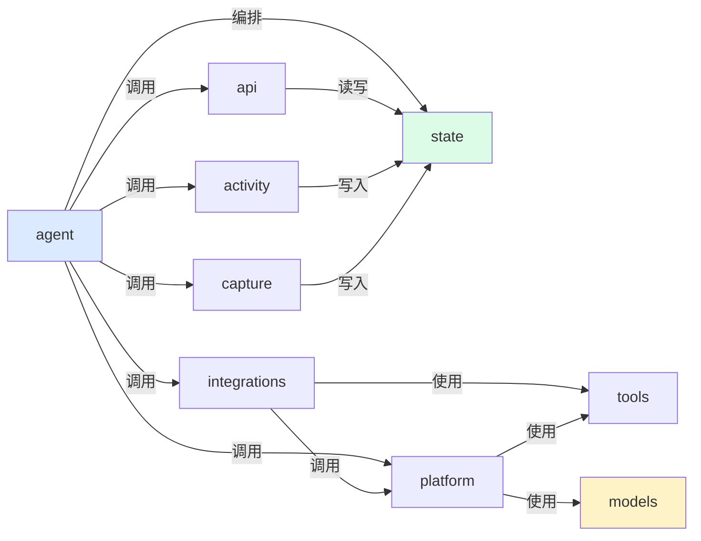

# 模块关系与依赖

<cite>
**本文档引用的文件**
- [tracker-core/src/lib.rs](file://tracker-core/src/lib.rs)
- [tracker-core/src/agent.rs](file://tracker-core/src/agent.rs)
- [tracker-core/src/integrations/mod.rs](file://tracker-core/src/integrations/mod.rs)
- [tracker-core/src/platform/mod.rs](file://tracker-core/src/platform/mod.rs)
</cite>

## 目录

1. [简介](#简介)
2. [模块结构图](#模块结构图)
3. [模块职责清单](#模块职责清单)
4. [依赖方向规则](#依赖方向规则)
5. [公开接口](#公开接口)

## 简介

tracker-core crate 内部由多个模块组成，每个模块有明确的职责边界。本文档描述模块间的依赖关系和接口契约。

## 模块结构图



## 模块职责清单

| 模块 | 文件 | 职责 | 公开接口 |
|------|------|------|---------|
| lib | lib.rs | 模块声明，条件编译桩，re-export | `start_agent`, `AgentConfig`, `AgentHandle`, `TrackerState` |
| agent | agent.rs | 启动编排，窗口监控主循环，富化调度，DocumentMemory | `start_agent`, `AgentConfig`, `AgentHandle` |
| state | state.rs | 共享状态存储，事件广播，原子标志位 | `TrackerState` |
| models | models.rs | 数据结构定义（WindowInfo, ActivityStats 等） | 全部结构体 |
| api | api/mod.rs | Axum 路由，REST/WS/SSE 处理，端口回退 | `spawn_api`, `ServerHandle` |
| activity | activity.rs | rdev 键鼠监听，60s 滑动窗口统计 | `spawn_activity_monitor` |
| capture | capture.rs | 2s 截图，480px 缩略图，PNG 编码 | `spawn_screen_capture` |
| bridge | bridge.rs | Token 生成/加载/迁移 | `load_or_create_token` |
| integrations | integrations/mod.rs | 富化管道编排，文档合并 | `enrich_window` |
| file_manager | integrations/file_manager.rs | Explorer/Finder/D-Bus 文件管理器查询 | `query` |
| terminal | integrations/terminal.rs | 终端检测，进程树遍历，cwd 采集 | `query`, `detect_terminal` |
| shell_files | integrations/shell_files.rs | Shell 集成 cwd 文件读取 | `read_shell_cwds` |
| linux_dbus | integrations/linux_dbus.rs | AT-SPI 无障碍树遍历 | `file_manager_state`, `document_url_for` |
| platform | platform/mod.rs | 平台抽象，进程信息，文档采集 | `active_window`, `enrich_platform_window_documents`, `process_info` |
| tools | tools.rs | 路径处理，文档分类，去重，隐私脱敏 | 各工具函数 |
| diagnostics | diagnostics.rs | panic hook，崩溃日志 | `install_panic_hook` |

## 依赖方向规则



**规则**：

1. **agent** 是编排层，可以依赖所有其他模块
2. **state** 和 **models** 是基础设施层，不依赖业务模块
3. **api** 只依赖 state 和 models
4. **platform** 和 **integrations** 通过 tools 和 models 间接通信
5. **activity** 和 **capture** 只写入 state，不读取其他业务模块

## 公开接口

### lib.rs Re-export

```rust
pub use agent::{start_agent, AgentConfig, AgentHandle};
pub use state::TrackerState;
```

外部消费者（如 desktop/src-tauri）只需导入这两个入口：

```rust
use tracker_core::{start_agent, AgentConfig};
```

### 条件编译桩

当 feature 被禁用时，lib.rs 提供空实现的模块桩：

```rust
#[cfg(not(feature = "activity"))]
pub mod activity {
    pub fn spawn_activity_monitor(_state: TrackerState, _window_seconds: u64) {}
}
```

这确保 agent.rs 中的调用代码无需条件编译即可编译通过。

**图表来源**
- [tracker-core/src/lib.rs:1-29](file://tracker-core/src/lib.rs#L1-L29)
- [tracker-core/src/agent.rs:1-10](file://tracker-core/src/agent.rs#L1-L10)
- [tracker-core/src/integrations/mod.rs:1-108](file://tracker-core/src/integrations/mod.rs#L1-L108)
