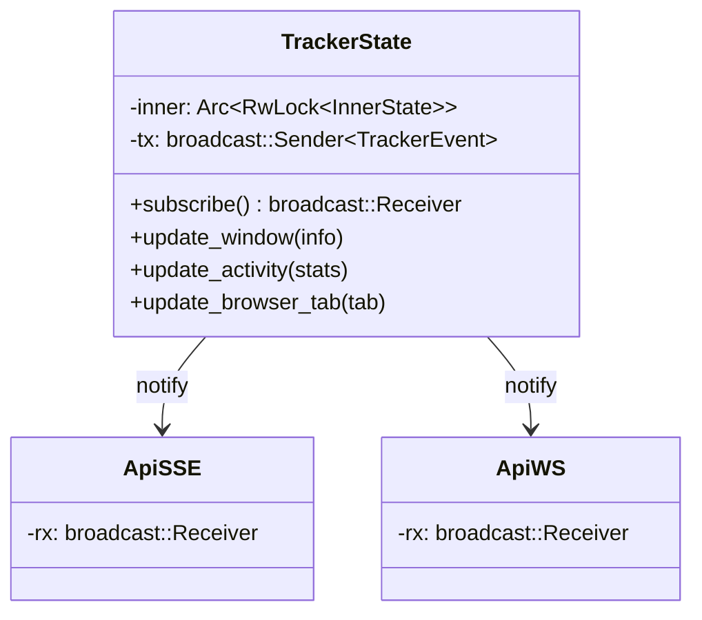
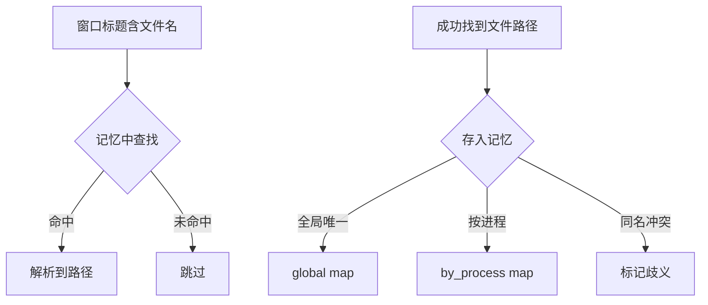

# 设计模式与架构原则

<cite>
**本文档引用的文件**
- [tracker-core/src/agent.rs](file://tracker-core/src/agent.rs)
- [tracker-core/src/state.rs](file://tracker-core/src/state.rs)
- [tracker-core/src/tools.rs](file://tracker-core/src/tools.rs)
</cite>

## 目录

1. [简介](#简介)
2. [设计模式](#设计模式)
3. [架构原则](#架构原则)
4. [错误处理策略](#错误处理策略)
5. [性能优化策略](#性能优化策略)

## 简介

AppTracker 在设计中采用了多种经典设计模式和架构原则，以实现低耦合、高可维护性和跨平台一致性。

## 设计模式

### 1. Observer 模式（事件广播）

TrackerState 内部使用 `broadcast::channel` 实现 Observer 模式：



每次状态变更自动通过 `tx.send()` 广播事件，所有订阅者（WS 客户端、SSE 流）自动接收。

### 2. Supervised Task 模式

`supervised()` 函数实现了一个轻量级的任务监督器：

```rust
async fn supervised<F, Fut>(name: &'static str, mut make_fut: F)
where
    F: FnMut() -> Fut + Send + 'static,
    Fut: Future<Output = ()> + Send + 'static,
{
    let mut attempt = 0u32;
    loop {
        let handle = tokio::spawn(make_fut());
        match handle.await {
            Ok(()) => return,           // 正常退出，不重启
            Err(e) if e.is_panic() => { // panic，重启
                attempt += 1;
                tokio::time::sleep(Duration::from_secs(2)).await;
            }
            Err(_) => return,           // 取消，不重启
        }
    }
}
```

**特点**：
- panic 后自动重启（带 2 秒延迟）
- 正常退出不重启（任务完成）
- 崩溃日志写入 `~/.active_tracker/crash.log`

### 3. Pipeline 模式（富化管道）

文档富化采用管道模式，多个处理器依次处理 WindowInfo：


### 4. Memoization 模式（文档记忆）

DocumentMemory 实现了带歧义检测的记忆缓存：



### 5. Strategy 模式（平台抽象）

`platform/mod.rs` 通过条件编译实现 Strategy 模式：

```rust
#[cfg(target_os = "windows")]
pub use self::windows::active_window;
#[cfg(target_os = "macos")]
pub use self::macos::active_window;
#[cfg(target_os = "linux")]
pub use self::linux::active_window;
```

三个平台实现相同的接口签名，调用方无需感知平台差异。

## 架构原则

### 单一数据源

所有状态集中存储在 TrackerState 中，不存在分散的状态副本：

| 状态 | 存储位置 | 访问方式 |
|------|---------|---------|
| 当前窗口 | `inner.window` | `RwLock` |
| 活动统计 | `inner.activity` | `RwLock` |
| 浏览器标签 | `inner.browser_tab` | `RwLock` |
| 截图 | `inner.latest_screenshot_png` | `RwLock` |
| 暂停状态 | `paused` | `AtomicBool` |
| 截图开关 | `capture_enabled` | `AtomicBool` |

### 接口隔离

每个模块只暴露必要的公开接口，内部实现细节隐藏：

- `platform/mod.rs` 只导出 `active_window` 和 `enrich_platform_window_documents`
- `integrations/mod.rs` 只导出 `enrich_window`
- `tools.rs` 的函数按用途分组，但全部公开供复用

### 依赖倒置

高层模块（agent）不直接依赖低层实现（platform/windows.rs），而是通过 platform/mod.rs 的统一接口：

```rust
// agent.rs 不关心具体平台
let info = active_window().await?;
```

### 开闭原则

新增平台支持只需：
1. 在 `platform/` 下添加新文件（如 `freebsd.rs`）
2. 在 `platform/mod.rs` 添加条件编译导出
3. 无需修改 agent.rs 或 integrations

## 错误处理策略

### 分层错误处理

| 层级 | 策略 |
|------|------|
| 平台 API | 返回 `anyhow::Result`，错误记录到 `WindowInfo.errors` |
| 富化管道 | 单个富化源失败不影响其他源，错误静默跳过 |
| API 服务器 | HTTP 错误返回标准状态码 |
| 任务 panic | supervised 捕获并重启，写入 crash.log |

### 错误传播示例

```rust
// agent.rs - 窗口查询失败仅 debug 日志，不中断循环
match active_window().await {
    Ok(mut info) => { /* 正常处理 */ }
    Err(exc) => {
        tracing::debug!(error = %exc, "active window query failed");
    }
}
```

## 性能优化策略

### 1. 双层去重避免冗余事件

- `fast_window_identity`：完整身份（含 title/geometry/documents）
- `window_identity_key`：轻量身份（仅 window_id + pid + app_name）

只在完整身份变化时才触发 API 广播，但富化结果使用轻量身份判断有效性。

### 2. 富化节流

富化请求受两个条件控制：
- 窗口身份变化时立即触发
- 同一窗口每 900ms 最多触发一次

```rust
if enrich_key != last_enrich_key
    || last_enrich_at.elapsed() >= Duration::from_millis(900)
{
    last_enrich_at = Instant::now();
    let _ = enrich_tx.send(Some(info));
}
```

### 3. spawn_blocking 隔离阻塞操作

所有可能阻塞的系统调用（Win32 API、osascript、lsof、PowerShell）都在 `spawn_blocking` 中执行，不阻塞 Tokio 运行时。

### 4. broadcast channel 容量

broadcast channel 容量设为 256，慢速消费者会收到 `Lagged` 错误而非阻塞生产者。

**图表来源**
- [tracker-core/src/agent.rs:161-189](file://tracker-core/src/agent.rs#L161-L189)
- [tracker-core/src/state.rs:17-24](file://tracker-core/src/state.rs#L17-L24)
