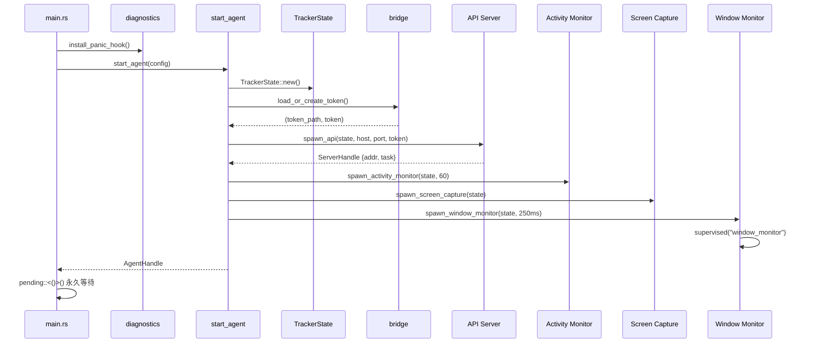
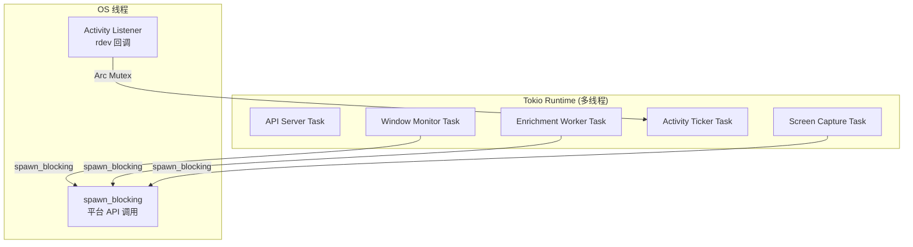
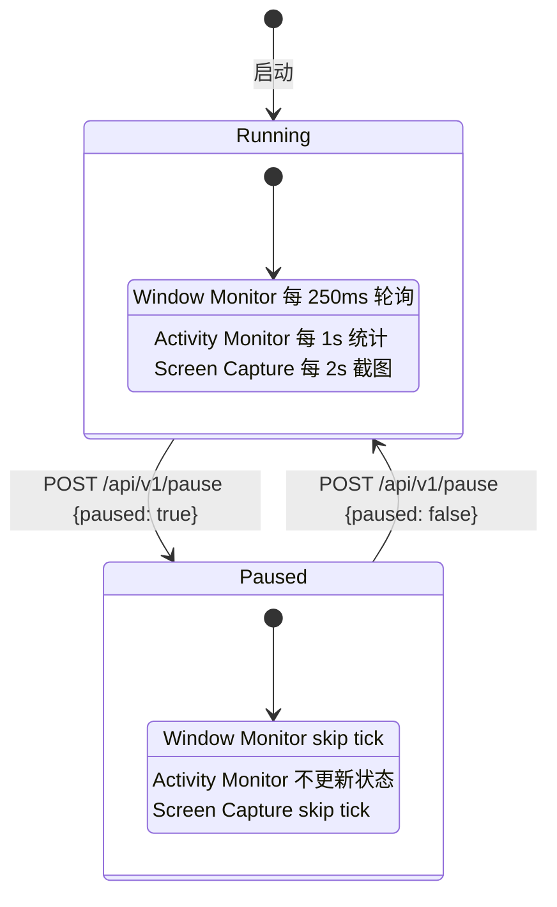
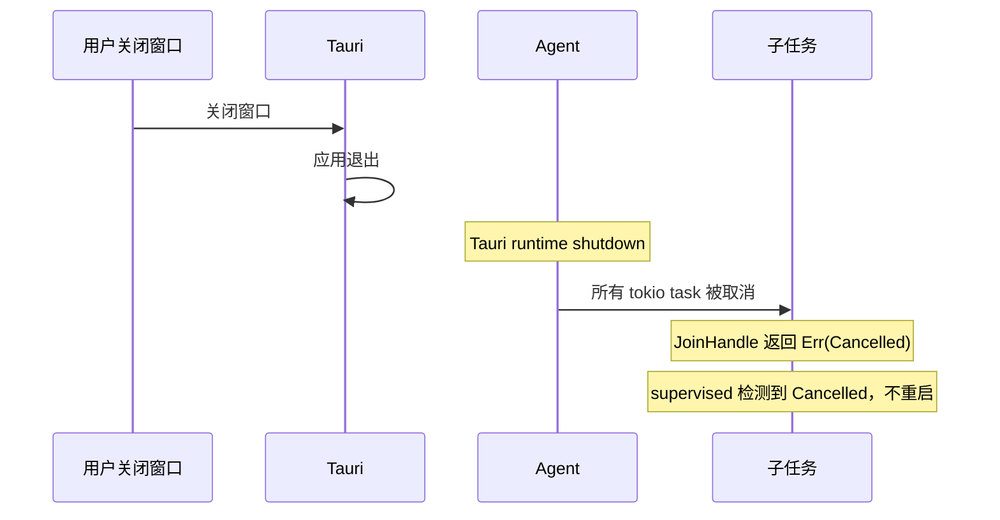

# 进程模型与生命周期

<cite>
**本文档引用的文件**
- [tracker-core/src/agent.rs](file://tracker-core/src/agent.rs)
- [tracker-core/src/activity.rs](file://tracker-core/src/activity.rs)
- [tracker-core/src/capture.rs](file://tracker-core/src/capture.rs)
- [desktop/src-tauri/src/main.rs](file://desktop/src-tauri/src/main.rs)
</cite>

## 目录

1. [简介](#简介)
2. [启动流程](#启动流程)
3. [任务模型](#任务模型)
4. [Supervised 重启机制](#supervised-重启机制)
5. [暂停与恢复](#暂停与恢复)
6. [关闭流程](#关闭流程)

## 简介

AppTracker 的运行时由多个并发任务组成，本文档描述这些任务的启动顺序、生命周期管理和异常恢复机制。

## 启动流程



### 启动顺序

1. **panic hook 安装**：捕获 panic 写入 `~/.active_tracker/crash.log`
2. **日志初始化**：tracing_subscriber，级别由 `RUST_LOG` 环境变量控制
3. **Tauri setup**：在 Tauri 的 `setup` 回调中异步启动 Agent
4. **Agent 启动**：
   - 创建 TrackerState
   - 生成/加载 Token
   - 启动 API 服务器
   - 启动活动监听器（可选）
   - 启动截图采集器（可选）
   - 启动窗口监控器

## 任务模型

### 任务清单

| 任务 | 启动方式 | 运行时 | supervised | Feature Gate |
|------|---------|--------|-----------|-------------|
| API Server | `tokio::spawn` | Tokio | 否 | 无 |
| Window Monitor | `tokio::spawn(supervised(...))` | Tokio | 是 | 无 |
| Enrichment Worker | `tokio::spawn(supervised(...))` | Tokio | 是 | 无 |
| Activity Listener | `std::thread::spawn` | OS 线程 | 否 | `activity` |
| Activity Ticker | `tokio::spawn` | Tokio | 否 | `activity` |
| Screen Capture | `tokio::spawn` | Tokio | 否 | `capture` |

### 线程模型



## Supervised 重启机制

`supervised()` 包装关键任务，提供 panic 后自动重启能力：

```rust
async fn supervised<F, Fut>(name: &'static str, mut make_fut: F) {
    let mut attempt = 0u32;
    loop {
        let handle = tokio::spawn(make_fut());
        match handle.await {
            Ok(()) => {
                tracing::warn!(worker = name, attempt, "worker exited cleanly");
                return;  // 正常退出，不重启
            }
            Err(join_err) if join_err.is_panic() => {
                attempt += 1;
                tracing::error!(worker = name, attempt, "worker panicked; restarting in 2s");
                tokio::time::sleep(Duration::from_secs(2)).await;
                // 继续循环，重启任务
            }
            Err(_) => {
                tracing::debug!(worker = name, "worker cancelled");
                return;  // 被取消，不重启
            }
        }
    }
}
```

### 重启行为

| 退出原因 | 行为 |
|---------|------|
| 正常返回（`Ok(())`） | 不重启，任务完成 |
| panic | 记录日志，等 2 秒，重启 |
| 被取消（JoinError 非 panic） | 不重启，任务结束 |

### 使用 supervised 的任务

- `window_monitor`：窗口监控主循环
- `window_enrichment`：富化工作器

这两个任务是系统核心，panic 不应导致整个应用退出。

## 暂停与恢复

暂停状态通过 `AtomicBool` 控制，影响所有采集任务：



各任务的暂停检查点：

```rust
// Window Monitor
if state.is_paused() { continue; }

// Activity Ticker
if !state.is_paused() { state.update_activity(stats).await; }

// Screen Capture
if state.is_paused() || !state.is_capture_enabled() { continue; }
```

## 关闭流程



Tauri 应用退出时，Tokio runtime 关闭，所有 spawn 的任务被取消。supervised 机制检测到 `JoinError` 非 panic 时直接返回，不尝试重启。

**图表来源**
- [tracker-core/src/agent.rs:45-71](file://tracker-core/src/agent.rs#L45-L71)
- [tracker-core/src/agent.rs:161-189](file://tracker-core/src/agent.rs#L161-L189)
- [desktop/src-tauri/src/main.rs:1-40](file://desktop/src-tauri/src/main.rs#L1-L40)
