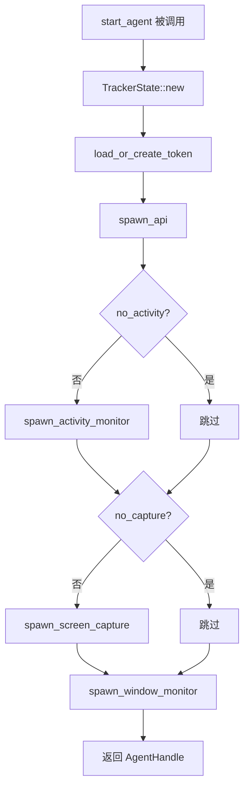

# Agent 系统概述

<cite>
**本文档引用的文件**
- [tracker-core/src/agent.rs](file://tracker-core/src/agent.rs)
- [tracker-core/src/lib.rs](file://tracker-core/src/lib.rs)
</cite>

## 目录

1. [简介](#简介)
2. [AgentConfig 配置](#agentconfig-配置)
3. [AgentHandle 句柄](#agenthandle-句柄)
4. [start_agent 启动流程](#start_agent-启动流程)
5. [子系统初始化顺序](#子系统初始化顺序)
6. [supervised 任务监督](#supervised-任务监督)

## 简介

Agent 是 AppTracker 的核心编排器，负责初始化所有子系统并管理它们的生命周期。`start_agent()` 是整个应用的入口函数，返回一个 `AgentHandle` 供外部持有。

## AgentConfig 配置

```rust
pub struct AgentConfig {
    pub host: String,           // API 绑定地址，默认 "127.0.0.1"
    pub api_port: u16,          // API 端口，默认 5007
    pub no_activity: bool,      // 禁用活动监听
    pub no_capture: bool,       // 禁用截图采集
    pub capture_default_on: bool, // 截图默认开启
    pub poll_interval_ms: u64,  // 窗口轮询间隔，默认 250ms
}
```

默认值通过 `Default` trait 实现：

| 字段 | 默认值 | 说明 |
|------|-------|------|
| `host` | `"127.0.0.1"` | 仅监听本地 |
| `api_port` | `5007` | HTTP/WS/SSE 端口 |
| `no_activity` | `false` | 默认启用活动监听 |
| `no_capture` | `false` | 默认启用截图采集 |
| `capture_default_on` | `false` | 截图默认关闭（需手动开启） |
| `poll_interval_ms` | `250` | 250ms 轮询间隔 |

## AgentHandle 句柄

```rust
pub struct AgentHandle {
    pub state: TrackerState,    // 共享状态
    pub api: ServerHandle,      // API 服务器句柄
    pub window_task: JoinHandle<()>, // 窗口监控任务句柄
}
```

`AgentHandle` 的生命周期与应用一致。持有它可防止子任务被 GC 回收。Tauri setup 中使用 `std::future::pending::<()>().await` 保持 Agent 存活。

## start_agent 启动流程



### 代码路径

```rust
pub async fn start_agent(config: AgentConfig) -> anyhow::Result<AgentHandle> {
    let state = TrackerState::new();
    let (token_path, token) = load_or_create_token().await?;
    let api = spawn_api(state.clone(), &config.host, config.api_port,
                        Arc::new(token), token_path).await?;

    if !config.no_activity {
        spawn_activity_monitor(state.clone(), 60);
    }
    if !config.no_capture {
        state.set_capture_enabled(config.capture_default_on);
        spawn_screen_capture(state.clone());
    }
    let window_task = spawn_window_monitor(state.clone(), config.poll_interval_ms);

    Ok(AgentHandle { state, api, window_task })
}
```

## 子系统初始化顺序

| 顺序 | 子系统 | 原因 |
|------|--------|------|
| 1 | TrackerState | 所有其他子系统依赖它 |
| 2 | Token | API 服务器需要 Token 用于浏览器桥接鉴权 |
| 3 | API Server | 需要在其他子系统开始产生数据前就绪 |
| 4 | Activity Monitor | 独立于窗口监控，可并行启动 |
| 5 | Screen Capture | 独立于窗口监控，可并行启动 |
| 6 | Window Monitor | 最后启动，依赖 API 和 State 就绪 |

## supervised 任务监督

`supervised()` 是一个通用的任务包装器，提供 panic 后自动重启能力：

```rust
pub async fn supervised<F, Fut>(name: &'static str, mut make_fut: F)
where
    F: FnMut() -> Fut + Send + 'static,
    Fut: Future<Output = ()> + Send + 'static,
```

### 设计要点

1. **闭包工厂**：接受 `FnMut() -> Fut` 而非 `Future`，每次重启创建新的 Future 实例
2. **命名日志**：`name` 参数用于日志标识，方便定位问题
3. **重启延迟**：panic 后等待 2 秒再重启，避免快速循环
4. **不重启正常退出**：如果任务正常返回 `()`，supervised 认为任务完成，不重启

### 被 supervised 保护的任务

- `window_monitor`：窗口监控主循环
- `window_enrichment`：富化工作器

**图表来源**
- [tracker-core/src/agent.rs:16-71](file://tracker-core/src/agent.rs#L16-L71)
- [tracker-core/src/agent.rs:161-189](file://tracker-core/src/agent.rs#L161-L189)
