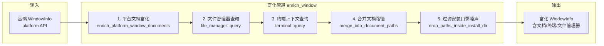
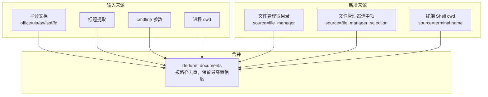

# 富化管道机制

<cite>
**本文档引用的文件**
- [tracker-core/src/integrations/mod.rs](file://tracker-core/src/integrations/mod.rs)
- [tracker-core/src/platform/mod.rs](file://tracker-core/src/platform/mod.rs)
- [tracker-core/src/agent.rs](file://tracker-core/src/agent.rs)
</cite>

## 目录

1. [简介](#简介)
2. [富化管道架构](#富化管道架构)
3. [富化阶段详解](#富化阶段详解)
4. [文档合并逻辑](#文档合并逻辑)
5. [噪声过滤](#噪声过滤)
6. [富化结果发布](#富化结果发布)

## 简介

富化管道（Enrichment Pipeline）是 AppTracker 的核心处理链，将基础的窗口信息（进程名、标题、PID）扩展为包含文档路径、终端上下文、文件管理器状态的完整上下文。

## 富化管道架构



### 入口函数

```rust
pub async fn enrich_window(mut info: WindowInfo) -> WindowInfo {
    info = enrich_platform_window_documents(info).await;
    let fm = file_manager::query(&info).await;
    let term = terminal::query(&info).await;
    info.file_manager_state = fm;
    info.terminal_context = term;
    merge_into_document_paths(&mut info);
    drop_paths_inside_install_dir(&mut info);
    info
}
```

## 富化阶段详解

### 阶段 1：平台文档富化

调用平台特定的文档检测逻辑，详见各平台文档：

| 平台 | 方法 | 来源 |
|------|------|------|
| Windows | Office COM + UIA 遍历 | [Windows平台实现](../平台适配层/Windows平台实现.md) |
| macOS | AX 属性 + AppleScript + lsof | [macOS平台实现](../平台适配层/macOS平台实现.md) |
| Linux | /proc/fd + AT-SPI | [Linux平台实现](../平台适配层/Linux平台实现.md) |

### 阶段 2：文件管理器查询

检测当前窗口是否为文件管理器，提取当前目录和选中项：

| 平台 | 实现 | 详情 |
|------|------|------|
| Windows | Shell.Application COM | [文件管理器集成](../集成系统/文件管理器集成.md) |
| macOS | Finder AppleScript | [文件管理器集成](../集成系统/文件管理器集成.md) |
| Linux | AT-SPI / cwd+title | [文件管理器集成](../集成系统/文件管理器集成.md) |

### 阶段 3：终端上下文查询

检测当前窗口是否为终端应用，提取 Shell 和进程信息：

- 遍历终端进程的子进程树
- 识别 Shell 进程（bash/zsh/fish 等）
- 读取 cwd（优先 Shell 集成文件，回退到进程 cwd）
- 脱敏命令行参数中的敏感信息

详见 [终端集成](../集成系统/终端集成.md)。

### 阶段 4：文档合并

`merge_into_document_paths()` 将所有来源的文档路径合并到统一的 `document_paths` 列表：



### 合并规则

1. 先排除已有的 file_manager 和 terminal 来源（避免重复）
2. 添加文件管理器目录（confidence: 0.95 活动窗口 / 0.7 后台）
3. 添加文件管理器选中项（confidence: 0.95 / 0.7）
4. 添加终端 Shell cwd（confidence: 0.9 shell_file / 0.8 process）
5. 合并所有来源，调用 `dedupe_documents()` 去重

### 阶段 5：噪声过滤

`drop_paths_inside_install_dir()` 移除落在进程可执行文件所在目录内的路径：

```rust
fn drop_paths_inside_install_dir(info: &mut WindowInfo) {
    let Some(exe) = info.process.as_ref().and_then(|p| p.executable.as_deref()) else {
        return;
    };
    let Some(dir) = Path::new(exe).parent() else {
        return;
    };
    info.document_paths.retain(|d| !path_under(&d.path, &dir));
}
```

这避免了应用安装目录下的 DLL、配置文件等被误报为"用户文档"。

## 文档合并逻辑

### dedupe_documents

```rust
pub fn dedupe_documents(docs: Vec<DocumentSource>) -> Vec<DocumentSource> {
    let mut best: HashMap<String, DocumentSource> = HashMap::new();
    for doc in docs {
        match best.get(&doc.path) {
            Some(cur) if cur.confidence >= doc.confidence => {}
            _ => { best.insert(doc.path.clone(), doc); }
        }
    }
    let mut out = best.into_values().collect::<Vec<_>>();
    out.sort_by(|a, b| b.confidence.total_cmp(&a.confidence));
    out
}
```

**规则**：
- 同一路径只保留置信度最高的条目
- 结果按置信度降序排列

### 置信度参考值

| 来源 | 置信度 | 说明 |
|------|--------|------|
| `office:word:active` | 0.99 | Office 活动文档 |
| `ax:doc` | 0.95 | macOS AX 文档属性 |
| `file_manager`（活动） | 0.95 | 文件管理器当前目录 |
| `lsof:title_match` | 0.92 | lsof 文件名匹配标题 |
| `fd:title_match` | 0.92 | /proc/fd 文件名匹配标题 |
| `terminal:shell_file` | 0.90 | Shell 集成文件 cwd |
| `browser:chrome` | 0.90 | 浏览器活动标签 |
| `title_memory` | 0.88 | 文档记忆恢复 |
| `cmdline` | 0.85 | 命令行参数 |
| `terminal:process` | 0.80 | 进程 cwd |
| `title` | 0.70 | 标题路径提取 |
| `cwd` | 0.30 | 进程 cwd（最低） |

## 富化结果发布

富化工作器通过 `should_publish_enriched()` 判断是否发布结果：

```rust
async fn should_publish_enriched(state: &TrackerState, expected_window_key: &str, enriched: &WindowInfo) -> bool {
    let Some(current) = state.current_window().await else {
        return true;  // 无当前窗口，直接发布
    };
    // 使用不含 title 的 key 判断是否同一窗口
    if window_identity_key(&current) != expected_window_key {
        return false;  // 窗口已切换，丢弃过期的富化结果
    }
    // 内容是否真的变化了
    fast_window_identity(&current) != fast_window_identity(enriched)
}
```

**图表来源**
- [tracker-core/src/integrations/mod.rs:14-23](file://tracker-core/src/integrations/mod.rs#L14-L23)
- [tracker-core/src/integrations/mod.rs:40-108](file://tracker-core/src/integrations/mod.rs#L40-L108)
- [tracker-core/src/agent.rs:191-206](file://tracker-core/src/agent.rs#L191-L206)
