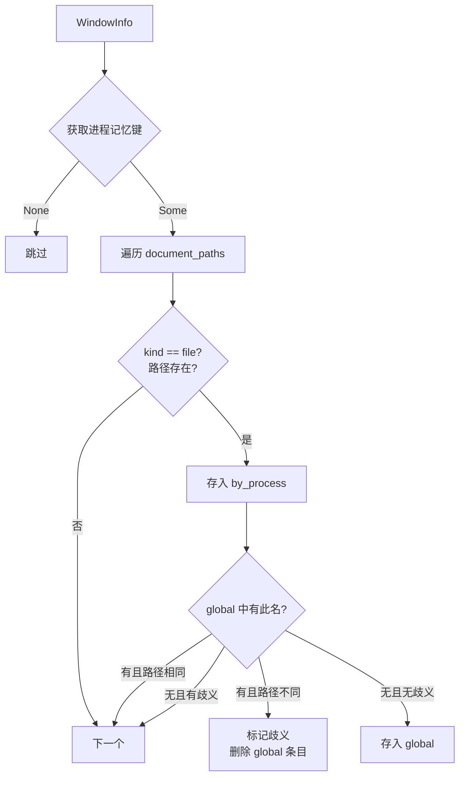
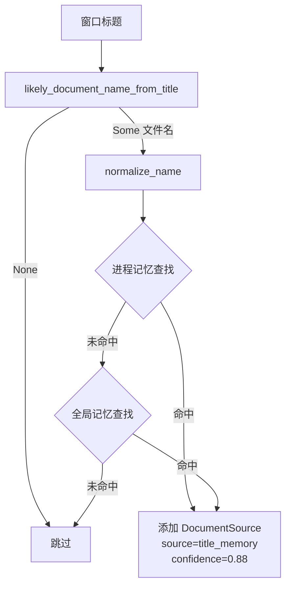
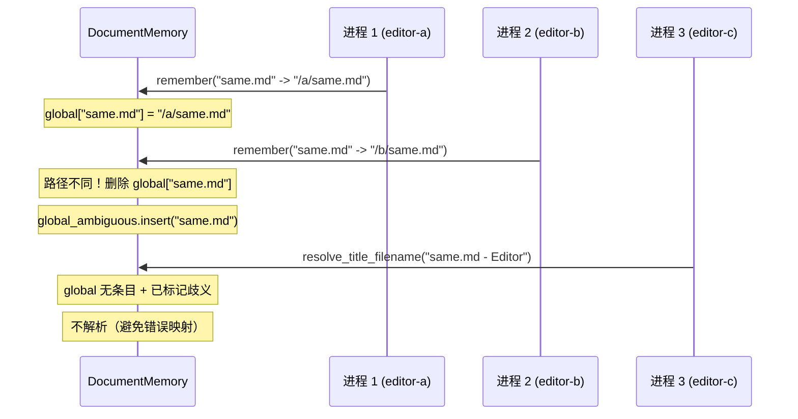

# 文档记忆系统

<cite>
**本文档引用的文件**
- [tracker-core/src/agent.rs](file://tracker-core/src/agent.rs)
- [tracker-core/src/tools.rs](file://tracker-core/src/tools.rs)
</cite>

## 目录

1. [简介](#简介)
2. [问题场景](#问题场景)
3. [DocumentMemory 结构](#documentmemory-结构)
4. [记忆写入逻辑](#记忆写入逻辑)
5. [标题解析逻辑](#标题解析逻辑)
6. [歧义检测](#歧义检测)
7. [使用示例](#使用示例)

## 简介

DocumentMemory 是一个运行时内存缓存，解决"窗口标题中有文件名，但无法直接解析到磁盘路径"的问题。它通过记忆之前成功解析的文件名-路径映射，在后续遇到相同文件名时直接恢复路径。

## 问题场景

许多应用（如 Typora、VS Code、WPS）的窗口标题格式为：

```
文件名.md - 应用名
document.docx - WPS Office
main.rs - Visual Studio Code
```

AppTracker 可以从标题中提取文件名（如 `文件名.md`），但不知道它在磁盘上的完整路径。如果之前通过富化管道（如 lsof、Office COM）成功找到过该文件的路径，DocumentMemory 可以记住这个映射。

## DocumentMemory 结构

```rust
struct DocumentMemory {
    by_process: HashMap<String, HashMap<String, String>>,  // 进程级记忆
    global: HashMap<String, String>,                        // 全局记忆
    global_ambiguous: HashSet<String>,                      // 歧义标记
}
```

### 三层记忆

| 层级 | 键 | 值 | 说明 |
|------|---|---|---|
| `by_process` | `pid:exe` -> `文件名` -> `路径` | 进程级映射 | 同一进程打开过的文件 |
| `global` | `文件名` -> `路径` | 全局映射 | 跨进程的唯一映射 |
| `global_ambiguous` | `文件名` | 集合 | 同名不同路径的歧义标记 |

## 记忆写入逻辑

`remember()` 方法在每次窗口信息更新时调用：



### 进程记忆键

```rust
fn process_memory_key(info: &WindowInfo) -> Option<String> {
    let proc_ = info.process.as_ref()?;
    Some(format!("{}:{}", proc_.pid,
        proc_.executable.as_deref().unwrap_or(&proc_.name)))
}
```

格式：`<pid>:<executable_path>`，如 `1234:/usr/bin/code`。

### 文件名规范化

```rust
fn normalize_name(name: &str) -> String {
    name.trim().to_lowercase()
}
```

文件名统一转小写并 trim，避免大小写差异导致匹配失败。

## 标题解析逻辑

`resolve_title_filename()` 在 `apply()` 中调用，尝试从标题中恢复文件路径：



### 标题文件名提取

`likely_document_name_from_title()` 的逻辑：

1. 按 `—` / `–` / ` - ` / ` — ` / ` – ` 分割标题，取左侧
2. 检查是否以已知扩展名结尾（如 `.md`、`.docx`、`.py`）
3. 如果是，返回清理后的文件名

```rust
// 示例
"知识库演进.md - Typora" -> Some("知识库演进.md")
"README" -> None  // 无已知扩展名
"main.rs - VS Code" -> Some("main.rs")
```

## 歧义检测

当两个不同进程打开同名但不同路径的文件时，全局记忆会产生歧义：



**关键规则**：
- 全局记忆要求同名文件的路径必须唯一
- 一旦发现同名不同路径，立即标记歧义并删除全局条目
- 进程级记忆不受歧义影响（每个进程独立维护自己的映射）

## 使用示例

### 场景：Typora 打开 markdown 文件

1. 用户在 Typora 中打开 `/home/user/docs/report.md`
2. 富化管道（lsof）找到文件路径，存入 document_paths
3. DocumentMemory.remember() 记住 `report.md -> /home/user/docs/report.md`
4. 用户切换到其他窗口再切回，标题显示 "report.md - Typora"
5. 基础平台查询只返回标题，无文件路径
6. DocumentMemory.resolve_title_filename() 从记忆中恢复路径
7. 最终 WindowInfo 中包含 source="title_memory" 的 DocumentSource

**图表来源**
- [tracker-core/src/agent.rs:285-364](file://tracker-core/src/agent.rs#L285-L364)
- [tracker-core/src/tools.rs:253-283](file://tracker-core/src/tools.rs#L253-L283)
