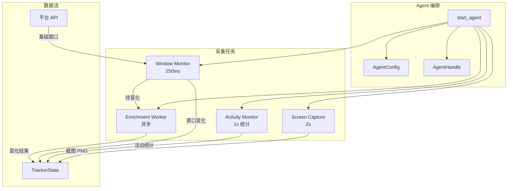

# 核心采集引擎

<cite>
**本文档引用的文件**
- [tracker-core/src/agent.rs](file://tracker-core/src/agent.rs)
- [tracker-core/src/lib.rs](file://tracker-core/src/lib.rs)
</cite>

## 目录

1. [简介](#简介)
2. [文档导航](#文档导航)
3. [引擎总览](#引擎总览)

## 简介

核心采集引擎是 AppTracker 的心脏，负责持续采集桌面活动信息并通过富化管道生成结构化的上下文数据。本章详细分析 Agent 系统、窗口监控、文档记忆、富化管道和活动/截图采集。

## 文档导航

| 文档 | 内容 |
|------|------|
| [Agent 系统概述](Agent系统概述.md) | Agent 启动、配置、主循环 |
| [窗口监控系统](窗口监控系统.md) | 250ms 轮询、窗口身份、去重逻辑 |
| [文档记忆系统](文档记忆系统.md) | DocumentMemory 标题-路径映射 |
| [富化管道机制](富化管道机制.md) | 多源文档富化、合并、过滤 |
| [活跃度与截图采集](活跃度与截图采集.md) | 键鼠统计、截图采集 |

## 引擎总览

**图表来源**
- [tracker-core/src/agent.rs:45-71](file://tracker-core/src/agent.rs#L45-L71)
