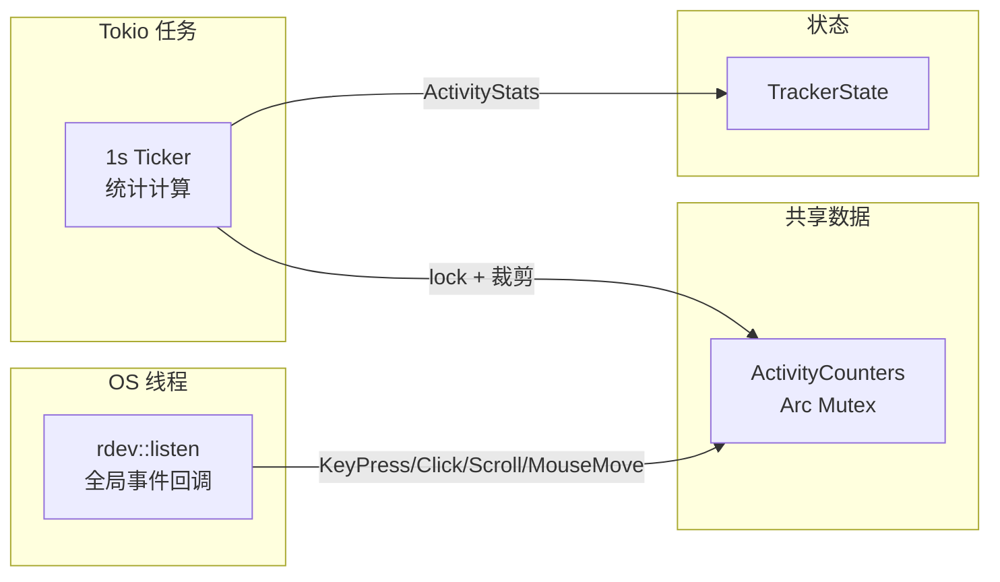
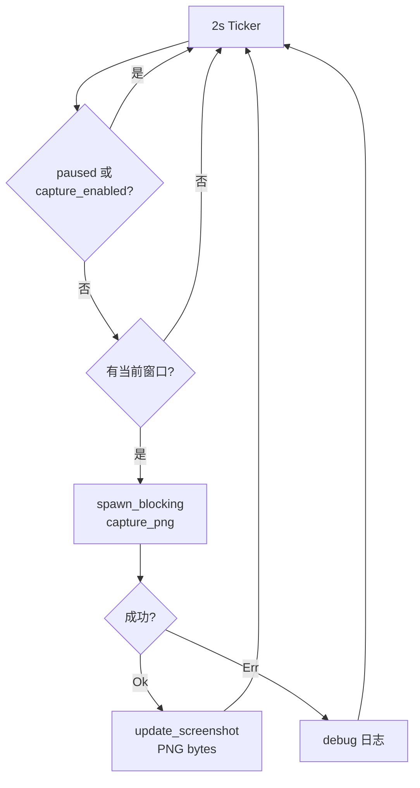

# 活跃度与截图采集

<cite>
**本文档引用的文件**
- [tracker-core/src/activity.rs](file://tracker-core/src/activity.rs)
- [tracker-core/src/capture.rs](file://tracker-core/src/capture.rs)
</cite>

## 目录

1. [简介](#简介)
2. [活跃度监控](#活跃度监控)
3. [滑动窗口机制](#滑动窗口机制)
4. [截图采集](#截图采集)
5. [Feature Flag 控制](#feature-flag-控制)

## 简介

活跃度监控和截图采集是 AppTracker 的两个可选采集模块，分别通过 `activity` 和 `capture` feature flags 控制。

## 活跃度监控

### 架构



### 事件类型

| 事件 | rdev EventType | 记录方式 |
|------|---------------|---------|
| 按键 | `KeyPress(_)` | `events.push_back((now, "key"))` |
| 鼠标点击 | `ButtonPress(_)` | `events.push_back((now, "click"))` |
| 滚动 | `Wheel { .. }` | `events.push_back((now, "scroll"))` |
| 鼠标移动 | `MouseMove { x, y }` | `mouse_moves.push_back((now, distance))` |

### 鼠标距离计算

```rust
if let Some((px, py)) = counters.last_mouse_pos {
    let dx = x - px;
    let dy = y - py;
    let distance = (dx * dx + dy * dy).sqrt();
    if distance.is_finite() && distance > 0.0 {
        counters.mouse_moves.push_back((Instant::now(), distance));
    }
}
counters.last_mouse_pos = Some((x, y));
```

使用欧几里得距离公式，累计所有鼠标移动的像素距离。

### ActivityStats 输出

```rust
pub struct ActivityStats {
    pub timestamp: f64,          // 时间戳
    pub window_seconds: u64,     // 窗口大小（默认 60s）
    pub keys_count: u64,         // 按键次数
    pub clicks_count: u64,       // 点击次数
    pub mouse_distance_px: f64,  // 鼠标距离（像素）
    pub scrolls_count: u64,      // 滚动次数
    pub idle_seconds: f64,       // 空闲秒数
}
```

## 滑动窗口机制

活动统计使用 60 秒滑动窗口，每秒裁剪过期数据：

```rust
let cutoff = Instant::now() - Duration::from_secs(window_seconds);
while counters.events.front().map(|(at, _)| *at < cutoff).unwrap_or(false) {
    counters.events.pop_front();
}
while counters.mouse_moves.front().map(|(at, _)| *at < cutoff).unwrap_or(false) {
    counters.mouse_moves.pop_front();
}
```

### 数据结构

使用 `VecDeque` 作为双端队列，支持高效的头部裁剪：

| 字段 | 类型 | 说明 |
|------|------|------|
| `events` | `VecDeque<(Instant, &str)>` | 键盘/点击/滚动事件 |
| `mouse_moves` | `VecDeque<(Instant, f64)>` | 鼠标移动距离 |
| `last_mouse_pos` | `Option<(f64, f64)>` | 上次鼠标位置 |
| `last_input` | `Instant` | 上次任意输入时间 |

### 空闲检测

```rust
idle_seconds: counters.last_input.elapsed().as_secs_f64(),
```

`last_input` 在每次键鼠事件时更新，`idle_seconds` 表示自上次输入以来的秒数。

## 截图采集

### 架构



### capture_png 实现

```rust
fn capture_png(info: &WindowInfo) -> anyhow::Result<Vec<u8>> {
    // 1. 确定截图区域
    let img = if let Some(g) = &info.geometry {
        let screen = Screen::from_point(g.x, g.y)?;
        screen.capture_area(g.x, g.y, width, height)?
    } else {
        Screen::all()?.first()?.capture()?
    };

    // 2. 缩放
    let mut dyn_img = image::DynamicImage::ImageRgba8(img);
    if w > MAX_THUMB_SIZE || h > MAX_THUMB_SIZE {
        dyn_img = dyn_img.thumbnail(MAX_THUMB_SIZE, MAX_THUMB_SIZE);
    }

    // 3. PNG 编码
    PngEncoder::new(&mut out).write_image(...)?;
    Ok(out.into_inner())
}
```

### 参数

| 参数 | 值 | 说明 |
|------|---|------|
| 采集间隔 | 2 秒 | `Duration::from_secs(2)` |
| 最大缩略图 | 480px | `MAX_THUMB_SIZE` |
| 格式 | PNG RGBA8 | 无损压缩 |
| 最大窗口尺寸 | 4096px | 安全限制 |

## Feature Flag 控制

### activity feature

```toml
[features]
activity = ["dep:rdev"]
```

禁用时 lib.rs 提供空桩：

```rust
#[cfg(not(feature = "activity"))]
pub mod activity {
    pub fn spawn_activity_monitor(_state: TrackerState, _window_seconds: u64) {}
}
```

### capture feature

```toml
[features]
capture = ["dep:image", "dep:screenshots"]
```

禁用时 lib.rs 提供空桩：

```rust
#[cfg(not(feature = "capture"))]
pub mod capture {
    pub fn spawn_screen_capture(_state: TrackerState) {}
}
```

### 运行时控制

即使编译时启用了 feature，运行时仍可通过配置禁用：

```rust
// AgentConfig
pub no_activity: bool,    // 不启动活动监听
pub no_capture: bool,     // 不启动截图采集
pub capture_default_on: bool, // 截图默认关闭
```

以及 API 运行时控制：

```bash
# 暂停/恢复
POST /api/v1/pause {"paused": true}

# 截图开关
POST /api/v1/capture {"enabled": true}
```

**图表来源**
- [tracker-core/src/activity.rs:1-123](file://tracker-core/src/activity.rs#L1-L123)
- [tracker-core/src/capture.rs:1-59](file://tracker-core/src/capture.rs#L1-L59)
