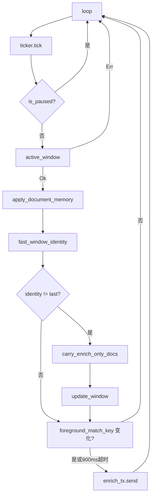
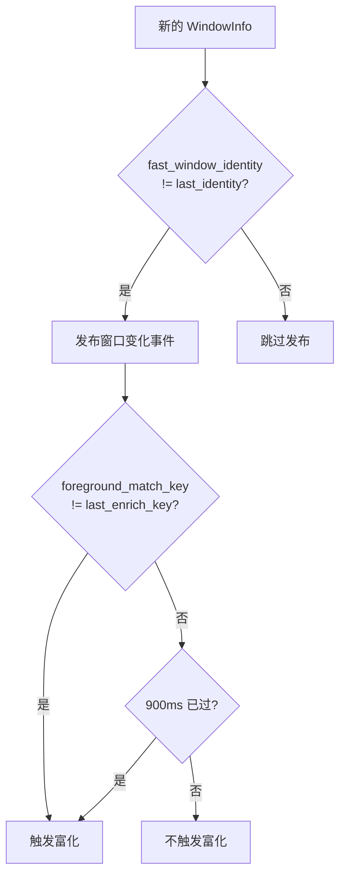

# 窗口监控系统

<cite>
**本文档引用的文件**
- [tracker-core/src/agent.rs](file://tracker-core/src/agent.rs)
- [tracker-core/src/platform/mod.rs](file://tracker-core/src/platform/mod.rs)
</cite>

## 目录

1. [简介](#简介)
2. [主循环逻辑](#主循环逻辑)
3. [窗口身份识别](#窗口身份识别)
4. [去重与变化检测](#去重与变化检测)
5. [富化触发策略](#富化触发策略)
6. [富化结果保护](#富化结果保护)

## 简介

窗口监控系统是 AppTracker 的核心采集循环，以 250ms 间隔轮询当前前台窗口，检测窗口变化并触发富化管道。

## 主循环逻辑



### 代码结构

```rust
async fn run_window_monitor(state: TrackerState, poll_interval_ms: u64) {
    let mut ticker = tokio::time::interval(Duration::from_millis(poll_interval_ms.max(100)));
    ticker.set_missed_tick_behavior(MissedTickBehavior::Skip);
    let mut last_identity = String::new();
    let mut last_enrich_key = String::new();
    let mut last_enrich_at = Instant::now() - Duration::from_secs(10);
    let document_memory = Arc::new(Mutex::new(DocumentMemory::default()));
    let (enrich_tx, enrich_rx) = tokio::sync::watch::channel(None::<WindowInfo>);
    spawn_window_enrichment_worker(state.clone(), document_memory.clone(), enrich_rx);

    loop {
        ticker.tick().await;
        if state.is_paused() { continue; }
        match active_window().await {
            Ok(mut info) => { /* 处理窗口信息 */ }
            Err(exc) => { tracing::debug!(...); }
        }
    }
}
```

## 窗口身份识别

AppTracker 使用两套窗口身份标识，服务于不同的判断场景：

### fast_window_identity

用于判断"窗口是否发生了变化"（触发 API 广播）：

```rust
fn fast_window_identity(info: &WindowInfo) -> String {
    format!("{}|{:?}|{:?}",
        info.identity_key(),
        info.file_manager_state,
        info.terminal_context)
}
```

包含：app_name + window_id + window_title + geometry + documents + file_manager_state + terminal_context。

### window_identity_key

用于判断"富化结果是否仍属于当前窗口"（避免标题抖动丢弃富化结果）：

```rust
fn window_identity_key(info: &WindowInfo) -> String {
    let pid = info.process.as_ref().map(|p| p.pid).unwrap_or_default();
    format!("{}|{}|{}",
        info.window_id.as_deref().unwrap_or_default(),
        pid,
        info.app_name)
}
```

仅包含：window_id + pid + app_name（不含 title）。

### 设计背景

Office/WPS 等应用在打字或翻页时，窗口标题会持续变化（如 "文档1.docx - WPS Office" 变为 "文档1.docx* - WPS Office"）。如果用含 title 的 key 判断富化结果有效性，会导致富化结果在落地前就被新的基础信息覆盖。

## 去重与变化检测

### 变化检测流程



### foreground_match_key

```rust
fn foreground_match_key(info: &WindowInfo) -> String {
    let pid = info.process.as_ref().map(|p| p.pid).unwrap_or_default();
    format!("{}|{}|{}",
        info.window_id.as_deref().unwrap_or_default(),
        pid,
        info.window_title)
}
```

与 window_identity_key 的区别：包含 window_title。用于判断"是否需要重新富化"——标题变化意味着窗口内容可能变了。

## 富化触发策略

富化请求受两个条件控制（OR 关系）：

1. **foreground_match_key 变化**：窗口标题或 PID 变化
2. **900ms 超时**：同一窗口每 900ms 至少富化一次

```rust
if enrich_key != last_enrich_key
    || last_enrich_at.elapsed() >= Duration::from_millis(900)
{
    last_enrich_key = enrich_key;
    last_enrich_at = Instant::now();
    let _ = enrich_tx.send(Some(info));
}
```

900ms 超时机制确保即使窗口标题不变（如纯阅读场景），富化管道仍能定期更新终端 cwd、文件管理器选中项等动态信息。

## 富化结果保护

### carry_enrich_only_docs

当窗口快速切换时，新的基础信息（仅含进程信息）可能覆盖之前富化得到的文档路径。`carry_enrich_only_docs` 将富化来源的文档从前一个 WindowInfo "搬运"到新的：

```rust
fn carry_enrich_only_docs(current: &WindowInfo, info: &mut WindowInfo) {
    for doc in &current.document_paths {
        if is_enrich_only_source(&doc.source) {
            info.document_paths.push(doc.clone());
        }
    }
    // 同时搬运 file_manager_state 和 terminal_context
}
```

### is_enrich_only_source

判断文档来源是否来自富化管道（而非基础平台查询）：

```rust
fn is_enrich_only_source(source: &str) -> bool {
    source == "file_manager"
        || source == "file_manager_selection"
        || source.starts_with("terminal:")
        || source.starts_with("office:")
        || source.starts_with("uia:")
        || source.starts_with("ax:")
        || source.starts_with("browser:")
        || source.starts_with("editor:")
        || source.starts_with("lsof")
        || source.starts_with("fd")
        || source.starts_with("libreoffice:")
        || source.starts_with("atspi:")
        || source.starts_with("dbus:")
}
```

**图表来源**
- [tracker-core/src/agent.rs:80-125](file://tracker-core/src/agent.rs#L80-L125)
- [tracker-core/src/agent.rs:214-264](file://tracker-core/src/agent.rs#L214-L264)
