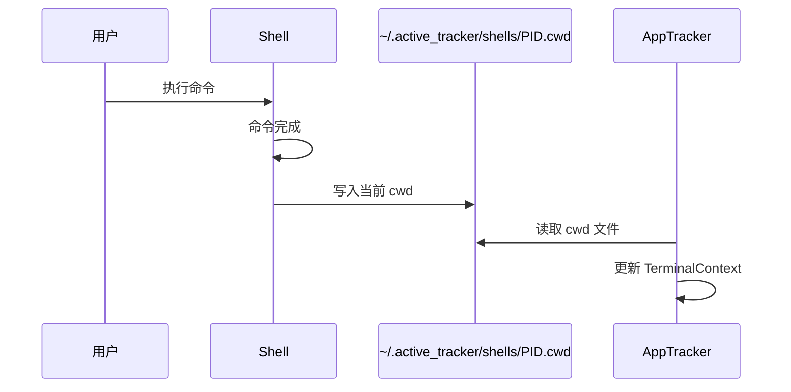
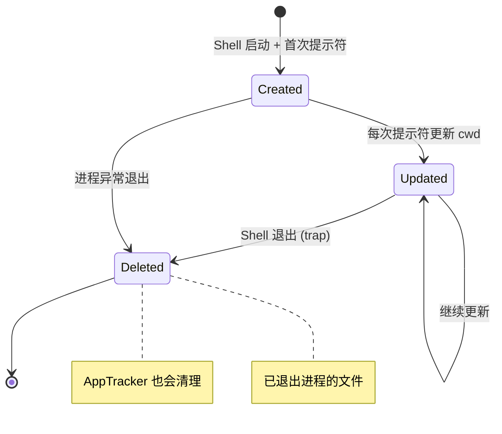

# Shell 集成脚本

<cite>
**本文档引用的文件**
- [shell_integration/bash.sh](file://shell_integration/bash.sh)
- [shell_integration/powershell.ps1](file://shell_integration/powershell.ps1)
- [shell_integration/zsh.sh](file://shell_integration/zsh.sh)
- [shell_integration/fish.fish](file://shell_integration/fish.fish)
- [shell_integration/cmd.cmd](file://shell_integration/cmd.cmd)
</cite>

## 目录

1. [简介](#简介)
2. [工作原理](#工作原理)
3. [Bash 集成](#bash-集成)
4. [Zsh 集成](#zsh-集成)
5. [Fish 集成](#fish-集成)
6. [PowerShell 集成](#powershell-集成)
7. [cmd.exe 集成](#cmdexe-集成)
8. [文件格式](#文件格式)
9. [安全考虑](#安全考虑)

## 简介

Shell 集成脚本通过在每次提示符显示时写入 cwd 文件，让 AppTracker 能够获取终端的实时工作目录。这是 cwd 检测的最可靠方式（优先级高于进程 cwd）。

## 工作原理



### 核心机制

1. Shell 集成脚本钩入提示符渲染流程
2. 每次提示符显示时，将 `$PWD` 写入 `~/.active_tracker/shells/<PID>.cwd`
3. AppTracker 的 `read_shell_cwds()` 函数读取这些文件
4. 文件名包含 Shell 进程 PID，用于匹配终端进程树

## Bash 集成

### 文件

`shell_integration/bash.sh`

### 安装

在 `~/.bashrc` 中添加：

```bash
source /path/to/AppTracker/shell_integration/bash.sh
```

### 实现

```bash
_active_tracker_dir="$HOME/.active_tracker/shells"

_active_tracker_update() {
    mkdir -p "$_active_tracker_dir" 2>/dev/null
    printf '%s\n' "$PWD" > "$_active_tracker_dir/$$.cwd" 2>/dev/null
    chmod 600 "$_active_tracker_dir/$$.cwd" 2>/dev/null

    # 记录最近一条命令
    local _last
    _last=$(fc -ln -1 2>/dev/null | sed 's/^[[:space:]]*//')
    if [ -n "$_last" ]; then
        printf '%s\n' "$_last" > "$_active_tracker_dir/$$.cmd" 2>/dev/null
    fi
}

# 钩入 PROMPT_COMMAND
case "$PROMPT_COMMAND" in
    *_active_tracker_update*) ;;
    *)
        if [ -n "$PROMPT_COMMAND" ]; then
            PROMPT_COMMAND="_active_tracker_update;${PROMPT_COMMAND}"
        else
            PROMPT_COMMAND="_active_tracker_update"
        fi
        ;;
esac

# 退出时清理
trap 'rm -f "$_active_tracker_dir/$$.cwd" "$_active_tracker_dir/$$.cmd"' EXIT
```

### 关键点

- 使用 `$$` 获取当前 Shell PID
- 文件权限设为 600（仅所有者可读写）
- EXIT trap 清理 cwd 和 cmd 文件

## Zsh 集成

### 文件

`shell_integration/zsh.sh`

### 安装

在 `~/.zshrc` 中添加：

```bash
source /path/to/AppTracker/shell_integration/zsh.sh
```

### 实现

与 bash 类似，但使用 `precmd` 钩子：

```zsh
autoload -Uz add-zsh-hook
add-zsh-hook precmd _active_tracker_update
```

## Fish 集成

### 文件

`shell_integration/fish.fish`

### 安装

在 `~/.config/fish/config.fish` 中添加：

```fish
source /path/to/AppTracker/shell_integration/fish.fish
```

### 实现

使用 fish 的 `fish_prompt` 事件：

```fish
function _active_tracker_update --on-event fish_prompt
    mkdir -p ~/.active_tracker/shells 2>/dev/null
    echo $PWD > ~/.active_tracker/shells/$fish_pid.cwd 2>/dev/null
end
```

## PowerShell 集成

### 文件

`shell_integration/powershell.ps1`

### 安装

在 PowerShell profile 中添加：

```powershell
. 'C:\path\to\AppTracker\shell_integration\powershell.ps1'
```

### 实现

```powershell
$ActiveTrackerDir = Join-Path $HOME ".active_tracker\shells"

# 保存原始 prompt
$global:_OriginalPrompt = $function:prompt

function global:prompt {
    $cwdFile = Join-Path $ActiveTrackerDir "$PID.cwd"
    try {
        [System.IO.File]::WriteAllText($cwdFile, "$($PWD.Path)`n", $ActiveTrackerUtf8)
        # 记录最近一条命令
        $last = Get-History -Count 1 -ErrorAction SilentlyContinue
        if ($last) {
            [System.IO.File]::WriteAllText($cmdFile, "$($last.CommandLine)`n", $ActiveTrackerUtf8)
        }
    } catch {}
    & $global:_OriginalPrompt
}

# 退出时清理
Register-EngineEvent -SourceIdentifier PowerShell.Exiting -Action {
    Remove-Item (Join-Path $ActiveTrackerDir "$PID.cwd") -ErrorAction SilentlyContinue
}
```

### 关键点

- 使用 UTF-8 编码写入文件
- 保存并调用原始 prompt 函数
- `PowerShell.Exiting` 事件清理文件

## cmd.exe 集成

### 文件

`shell_integration/cmd.cmd`

### 安装

运行 `shell_integration/install_windows.cmd` 或手动添加到注册表：

```
HKEY_CURRENT_USER\Software\Microsoft\Command Processor\AutoRun
```

### 实现

cmd.exe 的集成较为有限，通过 AutoRun 机制在每次 cmd 启动时执行。

## 文件格式

### cwd 文件

- **路径**：`~/.active_tracker/shells/<PID>.cwd`
- **内容**：当前工作目录的绝对路径，末尾换行符
- **编码**：UTF-8（PowerShell 使用 UTF-8 BOM）
- **权限**：600（Unix）

### cmd 文件

- **路径**：`~/.active_tracker/shells/<PID>.cmd`
- **内容**：最近执行的命令行，末尾换行符
- **编码**：同 cwd 文件

### 文件生命周期



## 安全考虑

### 文件权限

所有 cwd/cmd 文件权限设为 600，仅文件所有者可读写：

```bash
chmod 600 "$_active_tracker_dir/$$.cwd"
```

### 内容限制

- cwd 文件仅包含目录路径，不包含命令参数
- cmd 文件可能包含敏感信息（密码等），但文件权限限制了访问

### 自动清理

- Shell 退出时通过 trap 清理文件
- AppTracker 启动时检查进程是否存活，清理死进程的文件

**图表来源**
- [shell_integration/bash.sh:1-33](file://shell_integration/bash.sh#L1-L33)
- [shell_integration/powershell.ps1:1-34](file://shell_integration/powershell.ps1#L1-L34)
