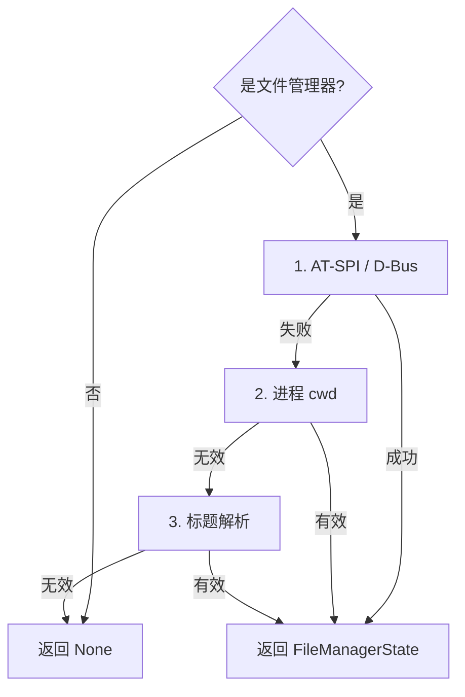

# 文件管理器集成

<cite>
**本文档引用的文件**
- [tracker-core/src/integrations/file_manager.rs](file://tracker-core/src/integrations/file_manager.rs)
- [tracker-core/src/integrations/linux_dbus.rs](file://tracker-core/src/integrations/linux_dbus.rs)
</cite>

## 目录

1. [简介](#简介)
2. [Windows Explorer](#windows-explorer)
3. [macOS Finder](#macos-finder)
4. [Linux 文件管理器](#linux-文件管理器)
5. [数据模型](#数据模型)

## 简介

文件管理器集成检测当前窗口是否为文件管理器应用，并提取当前目录和选中项信息。

## Windows Explorer

### 检测条件

```rust
let class = info.window_class.as_deref().unwrap_or_default();
let exe = info.process.as_ref().and_then(|p| p.executable.as_deref()).unwrap_or_default().to_lowercase();
if class != "CabinetWClass" && !exe.ends_with("explorer.exe") {
    return None;
}
```

### COM 查询

通过 `Shell.Application` COM 对象遍历所有 Explorer 窗口：

```powershell
$shell = New-Object -ComObject Shell.Application
foreach ($w in $shell.Windows()) {
    $url = [string]$w.LocationURL
    $folder = [System.Uri]::UnescapeDataString($uri.LocalPath)
    # 获取选中项
    foreach ($item in $w.Document.SelectedItems()) {
        Write-Output "S|$hwnd|$($item.Path)"
    }
}
```

### 输出格式

```
W*|12345|C:\Users\user\Documents        # 活动窗口
W|67890|C:\Users\user\Downloads         # 后台窗口
S|12345|C:\Users\user\Documents\report.docx  # 选中项
```

## macOS Finder

### 检测条件

```rust
if info.app_bundle_id.as_deref() != Some("com.apple.finder") && info.app_name != "Finder" {
    return None;
}
```

### AppleScript 查询

```applescript
tell application "Finder"
    -- 获取选中项
    set sList to (get selection)
    repeat with itemRef in sList
        set outText to outText & "S|" & (POSIX path of (itemRef as alias)) & linefeed
    end repeat

    -- 获取窗口列表
    set wList to Finder windows
    repeat with w in wList
        set targetPath to POSIX path of (target of w as alias)
        if wid is frontWinId then
            set outText to outText & "W*|" & wid & "|" & targetPath
        else
            set outText to outText & "W|" & wid & "|" & targetPath
        end if
    end repeat

    -- 桌面回退
    if outText is "" then
        set outText to "W*|desktop|" & (POSIX path of (desktop as alias))
    end if
end tell
```

### 注意事项

- `Finder windows`（而非 `windows`）排除桌面伪窗口
- 必须先物化窗口列表（`set wList to Finder windows`），避免 AppleScript 迭代陷阱
- 无 Finder 窗口时回退到桌面路径

## Linux 文件管理器

### 检测策略

通过进程名、可执行文件名、窗口类名和应用名匹配已知文件管理器：

```rust
const LINUX_FILE_MANAGER_HINTS: &[&str] = &[
    "nautilus", "dolphin", "nemo", "caja", "thunar",
    "pcmanfm", "krusader", "doublecmd", "ranger", ...
];
```

### 三级回退



### AT-SPI 查询

通过 AT-SPI 无障碍树遍历文件管理器的控件，提取路径文本：

```rust
pub async fn file_manager_state(info: &WindowInfo) -> Option<FileManagerState> {
    let conn = a11y_connection().await?;
    let (service, root) = find_application_by_pid(&conn, pid).await?;
    let texts = collect_path_texts(&conn, service, root).await;
    // 识别目录和文件
}
```

### 标题解析

从窗口标题中解析目录名：

```rust
fn linux_folder_from_title(title: &str) -> Option<String> {
    // "Documents — Dolphin" -> "Documents"
    let candidate = title.split(|ch| ch == '\u{2014}' || ch == '-').next()?.trim();
    // 尝试展开 ~ 和搜索常见目录
}
```

## 数据模型

### FileManagerState

```rust
pub struct FileManagerState {
    pub source: String,              // 来源标识
    pub windows: Vec<FileManagerWindow>,
}

pub struct FileManagerWindow {
    pub folder: String,              // 当前目录
    pub selected_items: Vec<String>, // 选中项路径
    pub hwnd_or_id: Option<String>,  // 窗口标识
    pub is_active: bool,             // 是否活动窗口
}
```

### 来源标识

| 平台 | source 值 |
|------|----------|
| Windows | `explorer_com_powershell` |
| macOS | `finder_applescript` |
| Linux (AT-SPI) | `atspi_walk` |
| Linux (cwd/title) | `linux_cwd_title` |

**图表来源**
- [tracker-core/src/integrations/file_manager.rs:1-408](file://tracker-core/src/integrations/file_manager.rs#L1-L408)
- [tracker-core/src/integrations/linux_dbus.rs:215-240](file://tracker-core/src/integrations/linux_dbus.rs#L215-L240)
