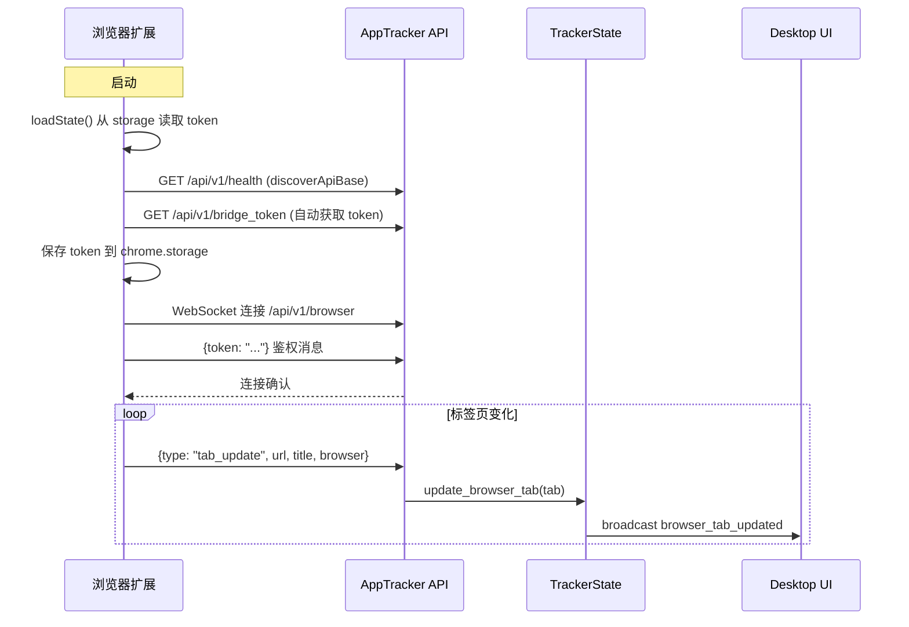

# 浏览器桥接

<cite>
**本文档引用的文件**
- [tracker-core/src/bridge.rs](file://tracker-core/src/bridge.rs)
- [tracker-core/src/api/mod.rs](file://tracker-core/src/api/mod.rs)
- [browser_extension/background.js](file://browser_extension/background.js)
- [browser_extension/manifest.json](file://browser_extension/manifest.json)
</cite>

## 目录

1. [简介](#简介)
2. [架构概览](#架构概览)
3. [Token 鉴权机制](#token-鉴权机制)
4. [WebSocket 协议](#websocket-协议)
5. [浏览器扩展实现](#浏览器扩展实现)
6. [多端口回退](#多端口回退)

## 简介

浏览器桥接通过 MV3 扩展和 WebSocket 连接，将浏览器活动标签页的 URL 和标题实时上报给 AppTracker。

## 架构概览



## Token 鉴权机制

### Token 生成

```rust
pub async fn load_or_create_token() -> anyhow::Result<(PathBuf, String)> {
    let dir = home.join(".apptracker");
    let path = dir.join("token");

    // 1. 尝试读取现有 token
    if let Ok(existing) = fs::read_to_string(&path).await {
        return Ok((path, existing.trim().to_string()));
    }

    // 2. 尝试从旧路径迁移
    let legacy = home.join(".active_tracker").join("token");
    if let Ok(raw) = fs::read_to_string(&legacy).await {
        fs::write(&path, &raw)?;
        return Ok((path, raw.trim().to_string()));
    }

    // 3. 生成新 token (32 字节随机 base64)
    let mut bytes = [0u8; 32];
    rand::thread_rng().fill_bytes(&mut bytes);
    let token = BASE64_URL_SAFE_NO_PAD.encode(bytes);
    fs::write(&path, &token)?;
    Ok((path, token))
}
```

### Token 存储位置

| 平台 | 路径 |
|------|------|
| 所有平台 | `~/.apptracker/token` |
| 旧版本（迁移源） | `~/.active_tracker/token` |

### Unix 权限

```rust
#[cfg(unix)]
async fn secure_token_file(path: &PathBuf) -> anyhow::Result<()> {
    perms.set_mode(0o600);  // 仅所有者可读写
    fs::set_permissions(path, perms).await?;
}
```

### API 端点

扩展通过 `/api/v1/bridge_token` 端点自动获取 Token：

```rust
async fn bridge_token_handler(State(state): State<ApiState>) -> Json<serde_json::Value> {
    Json(serde_json::json!({ "token": state.bridge_token.as_str() }))
}
```

## WebSocket 协议

### 连接端点

`ws://127.0.0.1:5007/api/v1/browser`

### 握手流程

1. 扩展建立 WebSocket 连接
2. 发送鉴权消息：`{"token": "base64_token"}`
3. 服务器验证 Token，不匹配则关闭连接
4. 验证通过后进入消息循环

### 消息格式

**扩展 -> 服务器**：

```json
{
  "type": "tab_update",
  "browser": "chrome",
  "windowId": 1,
  "tabId": 123,
  "url": "https://example.com",
  "title": "Example Page",
  "favIconUrl": "https://example.com/favicon.ico",
  "active": true
}
```

### 服务器处理

```rust
async fn browser_client(mut socket: WebSocket, state: ApiState) {
    // 鉴权
    let Some(Ok(Message::Text(raw))) = socket.next().await else { return; };
    let Ok(auth) = serde_json::from_str::<AuthMessage>(&raw) else { return; };
    if auth.token.trim() != state.bridge_token.as_str() {
        let _ = socket.close().await;
        return;
    }

    // 消息循环
    while let Some(msg) = socket.next().await {
        if let Ok(update) = serde_json::from_str::<TabUpdate>(&raw) {
            if update.message_type == "tab_update" {
                state.tracker.update_browser_tab(update.into_tab()).await;
            }
        }
    }
}
```

## 浏览器扩展实现

### 支持的浏览器

| 浏览器 | 标识 | Manifest |
|--------|------|----------|
| Chrome | `chrome` | MV3 |
| Edge | `edge` | MV3 |
| Brave | `chrome` | MV3 |
| Arc | `chrome` | MV3 |
| Firefox | `firefox` | MV3 (gecko) |

### 事件监听

```javascript
// 标签页激活
chrome.tabs.onActivated.addListener(pushActiveTab);

// 标签页更新（URL/标题变化）
chrome.tabs.onUpdated.addListener((_id, change) => {
    if (change.status === "complete" || change.url || change.title) pushActiveTab();
});

// 窗口焦点变化
chrome.windows.onFocusChanged.addListener((wid) => {
    if (wid !== chrome.windows.WINDOW_ID_NONE) pushActiveTab();
});
```

### 保活机制

```javascript
chrome.alarms.create("keepalive", { periodInMinutes: 0.5 });
chrome.alarms.onAlarm.addListener(() => {
    if (!ws || ws.readyState !== WebSocket.OPEN) connect();
});
```

每 30 秒检查连接状态，断开则自动重连。

### 重连策略

指数退避，最大 30 秒：

```javascript
function scheduleReconnect() {
    setTimeout(connect, reconnectDelay);
    reconnectDelay = Math.min(reconnectDelay * 2, 30000);
}
```

## 多端口回退

扩展和 UI 都支持自动端口回退（5007-5012）：

```javascript
function candidateApiBases(preferred = apiBase) {
    const bases = new Set();
    bases.add(normalized);
    for (let port = 5007; port <= 5012; port++) {
        url.port = String(port);
        bases.add(url.toString().replace(/\/$/, ""));
    }
    return Array.from(bases);
}

async function discoverApiBase() {
    for (const base of candidateApiBases()) {
        const res = await fetchWithTimeout(`${base}/api/v1/health`);
        if (data.service === "apptracker") return base;
    }
    return null;
}
```

**图表来源**
- [tracker-core/src/bridge.rs:1-52](file://tracker-core/src/bridge.rs#L1-L52)
- [tracker-core/src/api/mod.rs:193-269](file://tracker-core/src/api/mod.rs#L193-L269)
- [browser_extension/background.js:1-237](file://browser_extension/background.js#L1-L237)
