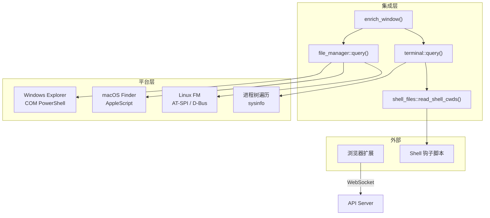

# 集成系统

<cite>
**本文档引用的文件**
- [tracker-core/src/integrations/mod.rs](file://tracker-core/src/integrations/mod.rs)
</cite>

## 目录

1. [简介](#简介)
2. [文档导航](#文档导航)
3. [集成架构](#集成架构)

## 简介

集成系统负责从文件管理器、终端和浏览器扩展中提取上下文信息，作为富化管道的重要组成部分。

## 文档导航

| 文档 | 内容 |
|------|------|
| [文件管理器集成](文件管理器集成.md) | Explorer/Finder/D-Bus 文件管理器检测 |
| [终端集成](终端集成.md) | 18 种终端 + Shell cwd 检测 |
| [浏览器桥接](浏览器桥接.md) | MV3 扩展 + WebSocket Token 鉴权 |

## 集成架构

**图表来源**
- [tracker-core/src/integrations/mod.rs:14-23](file://tracker-core/src/integrations/mod.rs#L14-L23)
