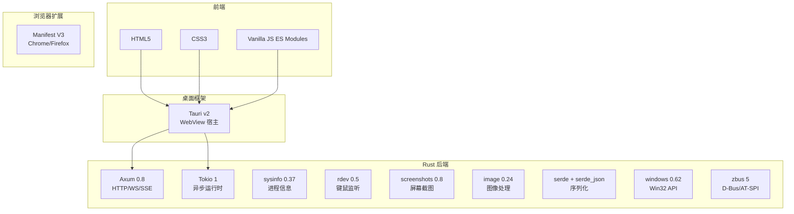
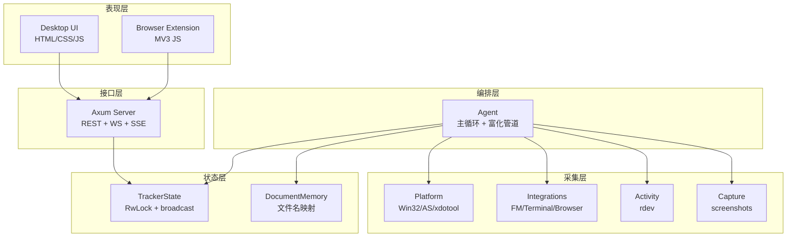

# 技术栈与架构概览

<cite>
**本文档引用的文件**
- [Cargo.toml](file://Cargo.toml)
- [tracker-core/Cargo.toml](file://tracker-core/Cargo.toml)
- [desktop/src-tauri/Cargo.toml](file://desktop/src-tauri/Cargo.toml)
- [desktop/package.json](file://desktop/package.json)
</cite>

## 目录

1. [简介](#简介)
2. [技术栈总览](#技术栈总览)
3. [Rust 后端依赖](#rust-后端依赖)
4. [前端技术栈](#前端技术栈)
5. [构建系统](#构建系统)
6. [Feature Flags](#feature-flags)
7. [架构分层](#架构分层)

## 简介

AppTracker 采用 Rust + Tauri v2 + vanilla HTML/CSS/JS 技术栈，追求极简依赖和低资源消耗。本文档详细列出所有技术选型及其理由。

## 技术栈总览



## Rust 后端依赖

### 核心依赖

| 依赖 | 版本 | 用途 |
|------|------|------|
| `tokio` | 1 | 异步运行时（rt-multi-thread, sync, time, net, fs） |
| `axum` | 0.8 | HTTP/WebSocket/SSE 服务器 |
| `serde` + `serde_json` | 1 | JSON 序列化/反序列化 |
| `sysinfo` | 0.37 | 跨平台进程信息采集 |
| `anyhow` | 1 | 错误处理 |
| `tracing` | 0.1 | 结构化日志 |
| `regex` | 1 | 正则匹配（标题路径提取） |
| `dirs` | 6 | 跨平台目录路径（home、config） |

### 平台特定依赖

| 依赖 | 平台 | 用途 |
|------|------|------|
| `windows` 0.62 | Windows | Win32 API（GetForegroundWindow、GetWindowText 等） |
| `zbus` 5 | Linux | D-Bus / AT-SPI 无障碍树遍历 |

### 可选依赖（Feature Gate）

| 依赖 | Feature | 用途 |
|------|---------|------|
| `rdev` 0.5 | `activity` | 全局键鼠事件监听 |
| `screenshots` 0.8 | `capture` | 屏幕截图采集 |
| `image` 0.24 | `capture` | PNG 编码、缩略图 |

## 前端技术栈

前端采用纯 vanilla 技术栈，无框架依赖：

| 技术 | 说明 |
|------|------|
| HTML5 | 语义化标签，单页应用 |
| CSS3 | CSS 自定义属性（设计令牌），CSS Grid 布局 |
| JavaScript | ES Modules，无构建步骤 |
| WebSocket | 实时事件接收 |
| Fetch API | REST 调用 |

### 设计决策

选择 vanilla JS 而非 React/Vue 的原因：

1. **零构建开销**：无需 Vite/Webpack，直接由 Tauri WebView 加载
2. **极小体积**：整个 UI 仅 3 个文件（index.html + main.js + styles.css）
3. **Tauri 原生集成**：Tauri 的 WebView 直接加载本地 HTML，无需开发服务器
4. **维护简单**：无框架升级负担，无 node_modules

## 构建系统

项目使用 Cargo workspace 管理两个 crate：

```toml
[workspace]
members = [
    "tracker-core",
    "desktop/src-tauri",
]
resolver = "2"
```

- **tracker-core**：纯 Rust 库，包含所有核心逻辑
- **desktop/src-tauri**：Tauri 应用壳，依赖 tracker-core

### 构建命令

```bash
# 开发模式
cd desktop && npm run tauri dev

# 仅编译核心库
cd tracker-core && cargo build

# Release 打包
cd desktop && npm run tauri build
```

## Feature Flags

tracker-core 支持以下 feature flags：

```toml
[features]
default = ["activity", "capture"]
activity = ["dep:rdev"]
capture = ["dep:image", "dep:screenshots"]
```

| Feature | 默认 | 说明 |
|---------|------|------|
| `activity` | 是 | 启用键鼠活动监听（rdev） |
| `capture` | 是 | 启用截图采集（screenshots + image） |

禁用 feature 时，对应的 `spawn_activity_monitor` 和 `spawn_screen_capture` 函数变为空操作：

```rust
#[cfg(not(feature = "activity"))]
pub mod activity {
    pub fn spawn_activity_monitor(_state: TrackerState, _window_seconds: u64) {}
}
```

## 架构分层



**图表来源**
- [tracker-core/Cargo.toml:1-39](file://tracker-core/Cargo.toml#L1-L39)
- [Cargo.toml:1-14](file://Cargo.toml#L1-L14)
