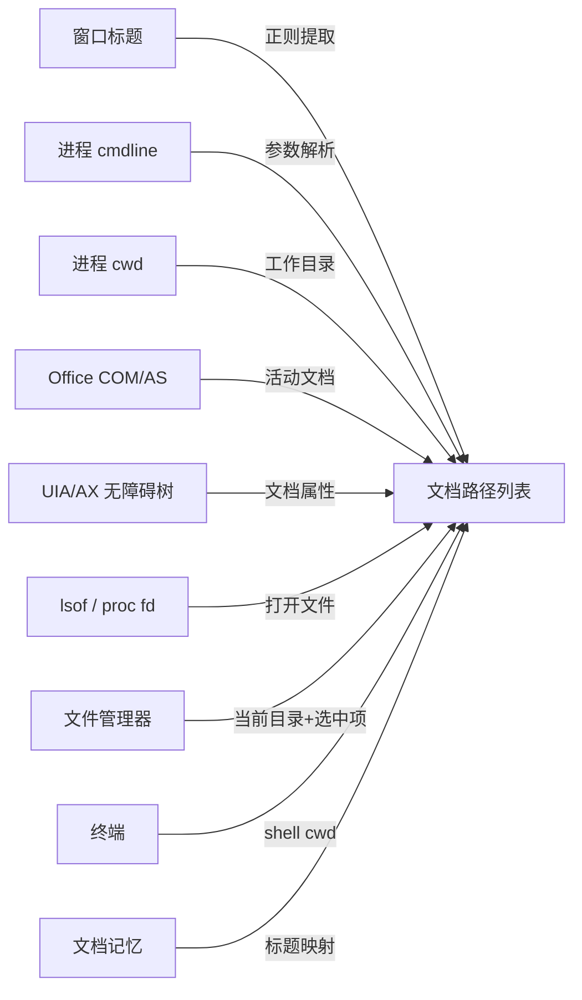
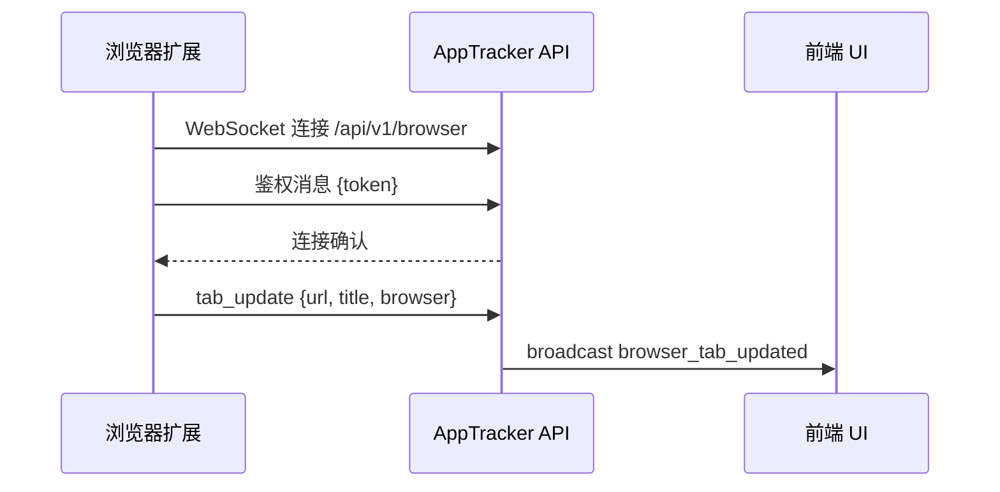

# 核心功能特性

<cite>
**本文档引用的文件**
- [tracker-core/src/agent.rs](file://tracker-core/src/agent.rs)
- [tracker-core/src/activity.rs](file://tracker-core/src/activity.rs)
- [tracker-core/src/capture.rs](file://tracker-core/src/capture.rs)
- [tracker-core/src/integrations/mod.rs](file://tracker-core/src/integrations/mod.rs)
</cite>

## 目录

1. [简介](#简介)
2. [窗口监控](#窗口监控)
3. [文档路径追踪](#文档路径追踪)
4. [终端上下文检测](#终端上下文检测)
5. [浏览器标签页桥接](#浏览器标签页桥接)
6. [键盘鼠标活动统计](#键盘鼠标活动统计)
7. [屏幕截图采集](#屏幕截图采集)
8. [API 服务](#api-服务)
9. [能力边界](#能力边界)

## 简介

AppTracker 提供六大核心功能模块，覆盖桌面活动的各个方面。每个模块均可独立启用或禁用，通过 Cargo feature flag 或运行时配置控制。

## 窗口监控

窗口监控是 AppTracker 的核心功能，以 250ms 间隔轮询当前前台窗口。

### 采集信息

| 字段 | 说明 | 来源 |
|------|------|------|
| `app_name` | 应用名称 | 平台 API |
| `window_title` | 窗口标题 | 平台 API |
| `window_id` | 窗口句柄/ID | 平台 API |
| `window_class` | 窗口类名（Windows）/ Bundle ID（macOS） | 平台 API |
| `geometry` | 窗口位置和尺寸 | 平台 API |
| `process` | 进程信息（PID、可执行文件路径、cmdline、cwd） | sysinfo |

### 窗口变化检测

Agent 使用双层去重机制避免冗余事件：

1. **fast_window_identity**：包含 app_name + window_id + window_title + geometry + documents，用于快速判断窗口是否变化
2. **window_identity_key**：仅包含 window_id + pid + app_name（不含 title），用于判断富化结果是否仍属于同一窗口

这解决了 Office/WPS 等应用在打字时标题持续变化导致富化结果被误丢弃的问题。

## 文档路径追踪

文档追踪通过多源管道（enrichment pipeline）识别用户当前正在查看或编辑的文件。

### 文档来源



### 文档分类

每个文档路径附带以下元数据：

- **path**：文件/目录的绝对路径
- **kind**：`file` / `folder` / `unknown`
- **source**：来源标识（如 `office:word:active`、`terminal:pwsh`、`title_memory`）
- **confidence**：置信度（0.0 ~ 1.0）
- **category**：`User`（用户操作产生）或 `Process`（进程上下文产生）

### 文档记忆系统

DocumentMemory 是一个运行时内存缓存，解决"标题中有文件名但无法直接解析到路径"的问题：

1. 当富化管道成功找到文件路径时，将 `文件名 -> 路径` 映射存入记忆
2. 下次遇到相同进程的窗口标题包含已知文件名时，直接从记忆中恢复路径
3. 全局记忆会检测歧义（同名不同路径），避免错误映射

## 终端上下文检测

终端集成能够识别当前窗口是否为终端应用，并提取其中运行的 Shell 和进程信息。

### 支持的终端模拟器

macOS Terminal、iTerm2、Alacritty、Kitty、WezTerm、Warp、Hyper、Ghostty、Tabby、Windows Terminal、conhost、cmd、PowerShell、mintty、GNOME Terminal、Konsole、xterm、Tilix、Terminator、XFCE Terminal、urxvt。

### 支持的 Shell

bash、zsh、fish、sh、dash、ash、ksh、tcsh、csh、pwsh、powershell、cmd.exe、nu、elvish、xonsh。

### cwd 检测策略

1. **Shell 集成文件**（优先级最高）：读取 `~/.active_tracker/shells/<PID>.cwd`
2. **进程 cwd**：通过 sysinfo 读取 `/proc/PID/cwd`（Linux）或 `Process.cwd()`（跨平台）

## 浏览器标签页桥接

通过 MV3 浏览器扩展，AppTracker 能够获取当前活动标签页的 URL 和标题。

### 工作流程



### Token 鉴权

扩展首次连接时需要一个 Token。Token 自动生成并存储在 `~/.apptracker/token`，用户可在 UI 中查看并复制到扩展。

## 键盘鼠标活动统计

通过 `rdev` 库监听全局键鼠事件，使用 60 秒滑动窗口统计：

| 指标 | 说明 |
|------|------|
| `keys_count` | 按键次数 |
| `clicks_count` | 鼠标点击次数 |
| `scrolls_count` | 滚动次数 |
| `mouse_distance_px` | 鼠标移动总距离（像素） |
| `idle_seconds` | 自上次输入以来的空闲秒数 |

活动监听运行在独立的 OS 线程上（`activity-listener`），通过 `Arc<Mutex<ActivityCounters>>` 与 Tokio 运行时共享数据。

## 屏幕截图采集

截图功能默认关闭，可通过 UI 开关或 API 启用。

### 技术细节

- **采集间隔**：2 秒
- **缩略图尺寸**：最大 480px（等比缩放）
- **格式**：PNG（RGBA8）
- **采集范围**：当前前台窗口区域（有 geometry 时）或主显示器全屏

### 条件编译

截图功能通过 `capture` feature flag 控制，禁用时 `spawn_screen_capture` 为空函数：

```rust
#[cfg(not(feature = "capture"))]
pub mod capture {
    pub fn spawn_screen_capture(_state: TrackerState) {}
}
```

## API 服务

AppTracker 在单个端口（默认 5007）上同时提供：

- **REST API**：快照查询、截图获取、状态控制
- **WebSocket**：实时事件推送 + 双向控制
- **SSE**：单向事件流（兼容性更好）

端口被占用时自动回退到 5008-5012。

## 能力边界

| 限制 | 说明 |
|------|------|
| 不采集文档内容 | 只追踪文件路径，不读取文件正文 |
| 不注入目标进程 | 所有信息通过系统 API 获取 |
| Wayland 受限 | Linux Wayland 下无法可靠获取前台窗口 |
| 浏览器需扩展 | 标签页信息依赖浏览器扩展桥接 |
| 截图仅窗口级 | 无法截取特定 DOM 元素 |

**图表来源**
- [tracker-core/src/agent.rs:80-125](file://tracker-core/src/agent.rs#L80-L125)
- [tracker-core/src/activity.rs:27-123](file://tracker-core/src/activity.rs#L27-L123)
- [tracker-core/src/capture.rs:11-29](file://tracker-core/src/capture.rs#L11-L29)
