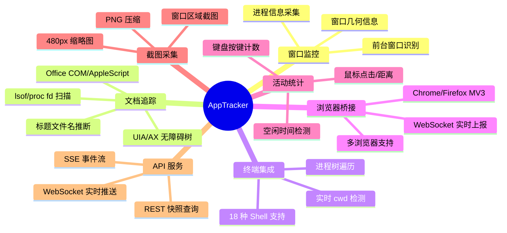
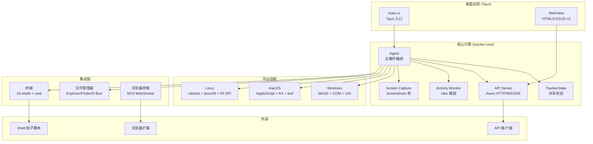

# 项目概述

<cite>
**本文档引用的文件**
- [README.md](file://README.md)
- [Cargo.toml](file://Cargo.toml)
- [tracker-core/src/lib.rs](file://tracker-core/src/lib.rs)
</cite>

## 目录

1. [简介](#简介)
2. [文档导航](#文档导航)
3. [项目定位](#项目定位)
4. [核心能力速览](#核心能力速览)
5. [技术架构总览](#技术架构总览)

## 简介

AppTracker 是一款开源的跨平台桌面活动追踪器，基于 Rust + Tauri v2 构建。它以低资源消耗的方式持续监控用户的桌面活动上下文，包括前台窗口、打开的文档、终端工作目录、浏览器标签页、键鼠活动以及可选的屏幕截图。

本文档是项目 Wiki 的入口页面，提供各子文档的导航和全局概览。

## 文档导航

| 文档 | 内容 |
|------|------|
| [项目介绍与定位](项目介绍与定位.md) | 项目背景、目标用户、使用场景 |
| [核心功能特性](核心功能特性.md) | 详细功能清单与能力边界 |
| [技术栈与架构概览](技术栈与架构概览.md) | 技术选型、依赖关系、构建系统 |
| [架构演进历程](架构演进历程.md) | 从 Active Tracker 到 AppTracker 的演进 |
| [架构设计](../架构设计/架构设计.md) | 整体架构、模块关系、设计模式 |
| [核心采集引擎](../核心采集引擎/核心采集引擎.md) | Agent 系统、窗口监控、文档记忆 |
| [平台适配层](../平台适配层/平台适配层.md) | Windows/macOS/Linux 平台实现 |
| [集成系统](../集成系统/集成系统.md) | 文件管理器、终端、浏览器桥接 |
| [API 接口参考](../API接口参考/API接口参考.md) | REST/WS/SSE 接口文档 |
| [前端架构](../前端架构/前端架构.md) | UI 设计、数据流、状态管理 |
| [开发指南](../开发指南/开发指南.md) | 构建部署、代码规范、调试排错 |
| [附录](../附录/附录.md) | Shell 脚本、配置参考 |

## 项目定位

AppTracker 定位于以下场景：

- **个人效率分析**：记录每天在哪些应用和文档上花费了多少时间
- **工作上下文恢复**：快速回忆"刚才在做什么"，恢复工作上下文
- **开发辅助**：集成到其他工具链中，提供实时桌面活动数据
- **自动化工作流**：通过 API 接入自动化脚本，基于活动状态触发动作

## 核心能力速览

## 技术架构总览

**图表来源**
- [tracker-core/src/lib.rs:1-29](file://tracker-core/src/lib.rs#L1-L29)
- [Cargo.toml:1-14](file://Cargo.toml#L1-L14)
